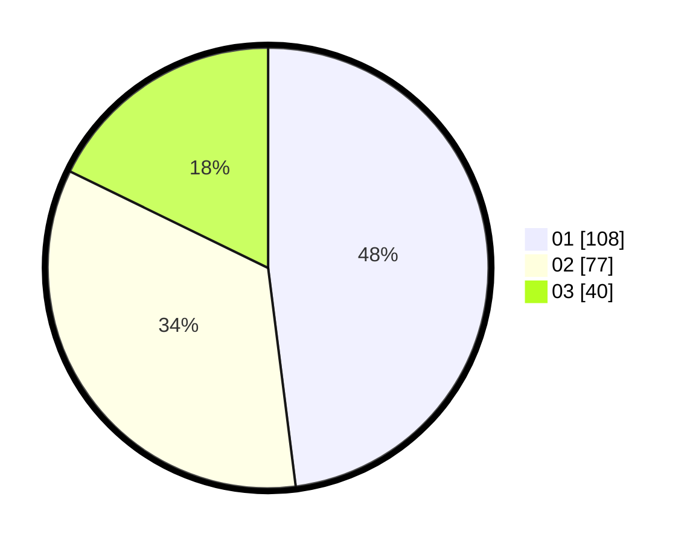

# Hasil

Hasil perolehan suara paslon dapat dilihat pada file paslon-01.txt, paslon-02.txt, dan paslon-03.txt.

Jika tidak ada, artinya data tersebut belum ada pada SIREKAP.

## Perolehan Suara

 * Paslon 01: **108**.
 * Paslon 02: **77**.
 * Paslon 03: **40**.

## Foto C Plano

https://sirekap-obj-formc.kpu.go.id/50b2/pemilu/ppwp/31/75/02/10/07/3175021007042-20240214-232243--33d1d576-792b-44a8-b70e-5c43d41b39a3.jpg

https://sirekap-obj-formc.kpu.go.id/50b2/pemilu/ppwp/31/75/02/10/07/3175021007042-20240214-232348--25d29df4-c393-4a53-b905-70418faf2e62.jpg

https://sirekap-obj-formc.kpu.go.id/50b2/pemilu/ppwp/31/75/02/10/07/3175021007042-20240214-232525--1ada45dc-7803-4824-b354-dc54d9344f8d.jpg
