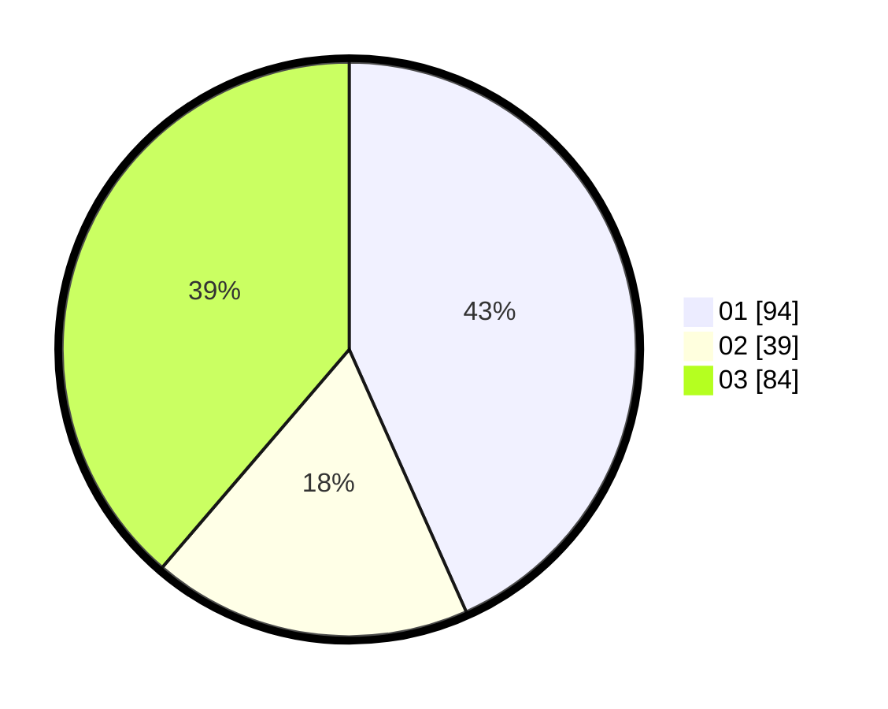

# Hasil

Hasil perolehan suara paslon dapat dilihat pada file paslon-01.txt, paslon-02.txt, dan paslon-03.txt.

Jika tidak ada, artinya data tersebut belum ada pada SIREKAP.

## Perolehan Suara

 * Paslon 01: **94**.
 * Paslon 02: **39**.
 * Paslon 03: **84**.

## Foto C Plano

https://sirekap-obj-formc.kpu.go.id/6058/pemilu/ppwp/31/75/02/10/07/3175021007051-20240214-211622--91447b22-114f-488e-be41-17093069fa65.jpg

https://sirekap-obj-formc.kpu.go.id/6058/pemilu/ppwp/31/75/02/10/07/3175021007051-20240214-211853--8814940d-5a98-419a-9f37-5686fd6ae4b9.jpg

https://sirekap-obj-formc.kpu.go.id/6058/pemilu/ppwp/31/75/02/10/07/3175021007051-20240214-212007--9ed4191b-4aa7-4bf2-beba-55bcca223bbe.jpg
