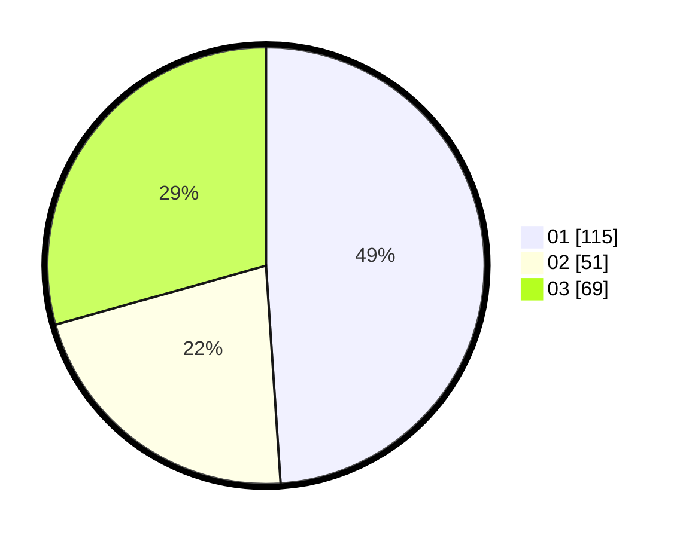

# Hasil

Hasil perolehan suara paslon dapat dilihat pada file paslon-01.txt, paslon-02.txt, dan paslon-03.txt.

Jika tidak ada, artinya data tersebut belum ada pada SIREKAP.

## Perolehan Suara

 * Paslon 01: **115**.
 * Paslon 02: **51**.
 * Paslon 03: **69**.

## Foto C Plano

https://sirekap-obj-formc.kpu.go.id/0b80/pemilu/ppwp/31/75/02/10/07/3175021007053-20240214-232033--e168c953-f374-4301-a74a-b335481ae56c.jpg

https://sirekap-obj-formc.kpu.go.id/0b80/pemilu/ppwp/31/75/02/10/07/3175021007053-20240214-225039--636f319d-8c62-4e56-a048-87f28c8c327e.jpg

https://sirekap-obj-formc.kpu.go.id/0b80/pemilu/ppwp/31/75/02/10/07/3175021007053-20240214-232134--41db0607-9b88-4a23-9c9d-1aabd44337c1.jpg
