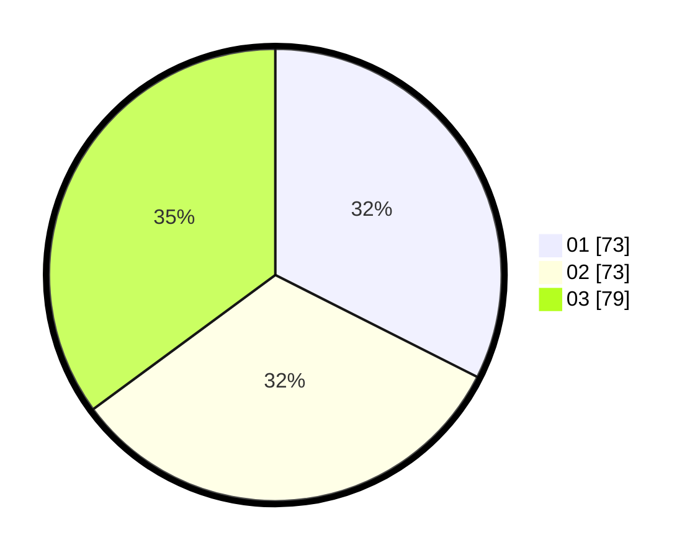

# Hasil

Hasil perolehan suara paslon dapat dilihat pada file paslon-01.txt, paslon-02.txt, dan paslon-03.txt.

Jika tidak ada, artinya data tersebut belum ada pada SIREKAP.

## Perolehan Suara

 * Paslon 01: **73**.
 * Paslon 02: **73**.
 * Paslon 03: **79**.

## Foto C Plano

https://sirekap-obj-formc.kpu.go.id/7155/pemilu/ppwp/31/75/02/10/07/3175021007058-20240214-155645--7c438b84-f3fc-46ec-8f6c-e27cf6b96e6e.jpg

https://sirekap-obj-formc.kpu.go.id/7155/pemilu/ppwp/31/75/02/10/07/3175021007058-20240214-155919--dd664f3a-b46d-4ca4-b419-7d0971232a82.jpg

https://sirekap-obj-formc.kpu.go.id/7155/pemilu/ppwp/31/75/02/10/07/3175021007058-20240214-160102--7815a047-e406-4136-919a-5596f32f1e2b.jpg

## DATA PEMILIH TETAP

Jumlah pemilih dalam DPT: **260**.
 * L: **121**.
 * P: **139**.

## DATA PENGGUNA HAK PILIH

Jumlah pengguna hak pilih dalam DPT: **222**.
 * L: **104**.
 * P: **118**.

Jumlah pengguna hak pilih dalam DPTb: **7**.
 * L: **4**.
 * P: **3**.

Jumlah pengguna hak pilih dalam DPK: **0**.
 * L: **0**.
 * P: **0**.

Jumlah pengguna hak pilih: **229**.
 * L: **108**.
 * P: **121**.

## JUMLAH SUARA SAH DAN TIDAK SAH

JUMLAH SELURUH SUARA SAH: **225**.

JUMLAH SUARA TIDAK SAH: **4**.

JUMLAH SELURUH SUARA SAH DAN SUARA TIDAK SAH: **229**.
