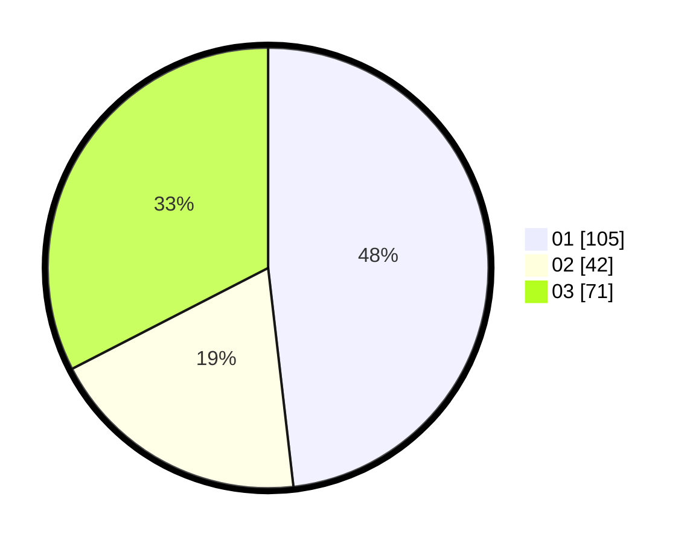

# Hasil

Hasil perolehan suara paslon dapat dilihat pada file paslon-01.txt, paslon-02.txt, dan paslon-03.txt.

Jika tidak ada, artinya data tersebut belum ada pada SIREKAP.

## Perolehan Suara

 * Paslon 01: **105**.
 * Paslon 02: **42**.
 * Paslon 03: **71**.

## Foto C Plano

https://sirekap-obj-formc.kpu.go.id/3869/pemilu/ppwp/31/75/02/10/07/3175021007069-20240214-155515--68553589-0359-4480-a602-e3a62f448ede.jpg

https://sirekap-obj-formc.kpu.go.id/3869/pemilu/ppwp/31/75/02/10/07/3175021007069-20240214-190128--f83f3bd6-6ca6-45de-aa41-3f23ab7b9f67.jpg

https://sirekap-obj-formc.kpu.go.id/3869/pemilu/ppwp/31/75/02/10/07/3175021007069-20240215-134415--888dddf6-ea0c-491b-ad51-93e53b28a735.jpg

## DATA PEMILIH TETAP

Jumlah pemilih dalam DPT: **275**.
 * L: **119**.
 * P: **156**.

## DATA PENGGUNA HAK PILIH

Jumlah pengguna hak pilih dalam DPT: **209**.
 * L: **90**.
 * P: **119**.

Jumlah pengguna hak pilih dalam DPTb: **8**.
 * L: **2**.
 * P: **6**.

Jumlah pengguna hak pilih dalam DPK: **4**.
 * L: **3**.
 * P: **1**.

Jumlah pengguna hak pilih: **221**.
 * L: **95**.
 * P: **126**.

## JUMLAH SUARA SAH DAN TIDAK SAH

JUMLAH SELURUH SUARA SAH: **218**.

JUMLAH SUARA TIDAK SAH: **3**.

JUMLAH SELURUH SUARA SAH DAN SUARA TIDAK SAH: **221**.
