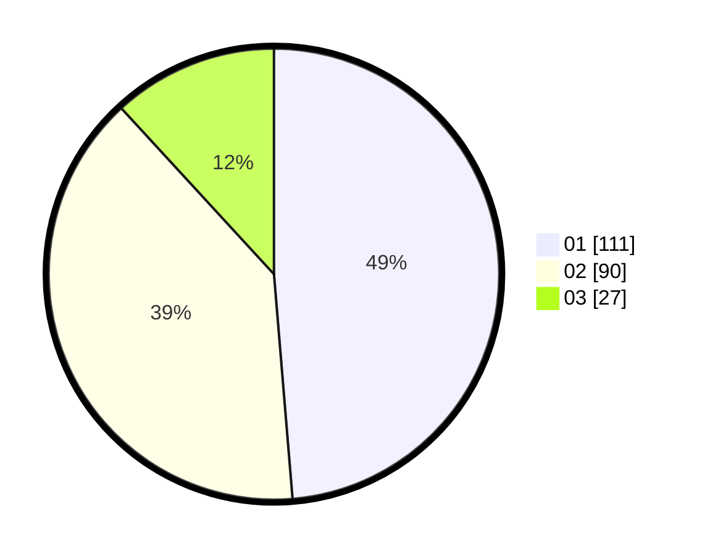

# Hasil

Hasil perolehan suara paslon dapat dilihat pada file paslon-01.txt, paslon-02.txt, dan paslon-03.txt.

Jika tidak ada, artinya data tersebut belum ada pada SIREKAP.

## Perolehan Suara

 * Paslon 01: **111**.
 * Paslon 02: **90**.
 * Paslon 03: **27**.

## Foto C Plano

https://sirekap-obj-formc.kpu.go.id/429d/pemilu/ppwp/31/75/02/10/07/3175021007081-20240214-190928--f1efcd53-c512-4164-8a98-78bd1dbc0569.jpg

https://sirekap-obj-formc.kpu.go.id/429d/pemilu/ppwp/31/75/02/10/07/3175021007081-20240214-190754--217e6e87-fb9a-4ff0-a714-088df01eb178.jpg

https://sirekap-obj-formc.kpu.go.id/429d/pemilu/ppwp/31/75/02/10/07/3175021007081-20240214-191140--ad3bf690-c8fd-450b-a9ec-74fc67744c8a.jpg

## DATA PEMILIH TETAP

Jumlah pemilih dalam DPT: **287**.
 * L: **132**.
 * P: **155**.

## DATA PENGGUNA HAK PILIH

Jumlah pengguna hak pilih dalam DPT: **215**.
 * L: **112**.
 * P: **103**.

Jumlah pengguna hak pilih dalam DPTb: **13**.
 * L: **6**.
 * P: **7**.

Jumlah pengguna hak pilih dalam DPK: **1**.
 * L: **0**.
 * P: **1**.

Jumlah pengguna hak pilih: **229**.
 * L: **118**.
 * P: **111**.

## JUMLAH SUARA SAH DAN TIDAK SAH

JUMLAH SELURUH SUARA SAH: **228**.

JUMLAH SUARA TIDAK SAH: **1**.

JUMLAH SELURUH SUARA SAH DAN SUARA TIDAK SAH: **229**.
