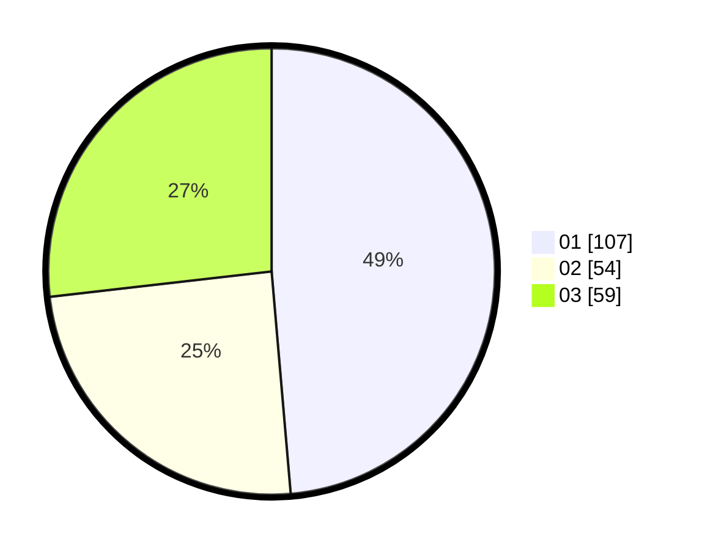

# Hasil

Hasil perolehan suara paslon dapat dilihat pada file paslon-01.txt, paslon-02.txt, dan paslon-03.txt.

Jika tidak ada, artinya data tersebut belum ada pada SIREKAP.

## Perolehan Suara

 * Paslon 01: **107**.
 * Paslon 02: **54**.
 * Paslon 03: **59**.

## Foto C Plano

https://sirekap-obj-formc.kpu.go.id/ee5d/pemilu/ppwp/31/75/02/10/07/3175021007089-20240215-004721--9de6ae6b-8264-4e3d-8ab3-5881bd52b5f8.jpg

https://sirekap-obj-formc.kpu.go.id/ee5d/pemilu/ppwp/31/75/02/10/07/3175021007089-20240215-004742--3cad5f58-f6a7-47f9-898a-ea066614cbbb.jpg

https://sirekap-obj-formc.kpu.go.id/ee5d/pemilu/ppwp/31/75/02/10/07/3175021007089-20240214-233758--52f54302-4765-45fe-9a2c-5957a7ac68f3.jpg
