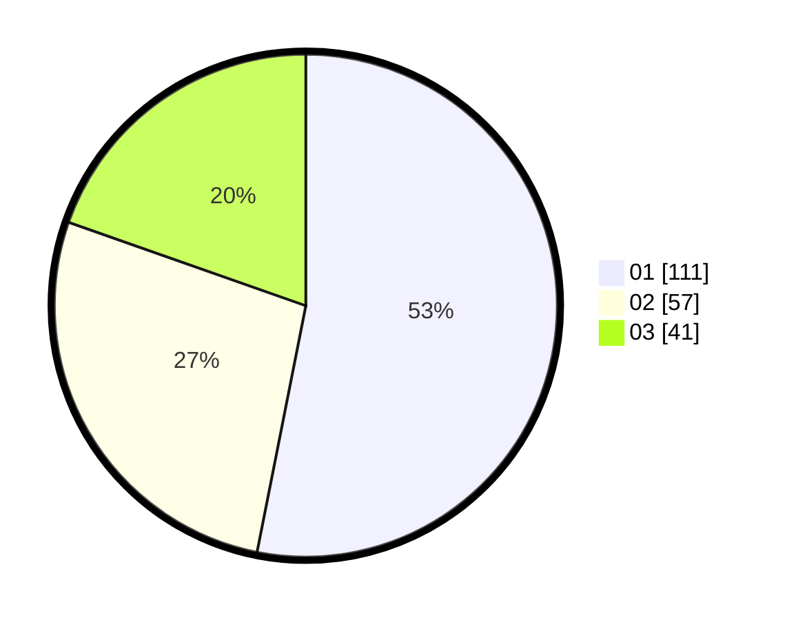

# Hasil

Hasil perolehan suara paslon dapat dilihat pada file paslon-01.txt, paslon-02.txt, dan paslon-03.txt.

Jika tidak ada, artinya data tersebut belum ada pada SIREKAP.

## Perolehan Suara

 * Paslon 01: **111**.
 * Paslon 02: **57**.
 * Paslon 03: **41**.

## Foto C Plano

https://sirekap-obj-formc.kpu.go.id/7d07/pemilu/ppwp/31/75/02/10/07/3175021007094-20240214-190826--f7194f1b-ed4a-4aed-8d92-b5386633bbc2.jpg

https://sirekap-obj-formc.kpu.go.id/7d07/pemilu/ppwp/31/75/02/10/07/3175021007094-20240214-185155--c727cccd-2219-4847-8192-4f9d1e521645.jpg

https://sirekap-obj-formc.kpu.go.id/7d07/pemilu/ppwp/31/75/02/10/07/3175021007094-20240214-190632--1de3ea5f-b1db-4290-a663-2b2b3b74a821.jpg

## DATA PEMILIH TETAP

Jumlah pemilih dalam DPT: **287**.
 * L: **136**.
 * P: **151**.

## DATA PENGGUNA HAK PILIH

Jumlah pengguna hak pilih dalam DPT: **206**.
 * L: **92**.
 * P: **114**.

Jumlah pengguna hak pilih dalam DPTb: **2**.
 * L: **1**.
 * P: **1**.

Jumlah pengguna hak pilih dalam DPK: **2**.
 * L: **0**.
 * P: **2**.

Jumlah pengguna hak pilih: **210**.
 * L: **93**.
 * P: **117**.

## JUMLAH SUARA SAH DAN TIDAK SAH

JUMLAH SELURUH SUARA SAH: **209**.

JUMLAH SUARA TIDAK SAH: **1**.

JUMLAH SELURUH SUARA SAH DAN SUARA TIDAK SAH: **210**.
