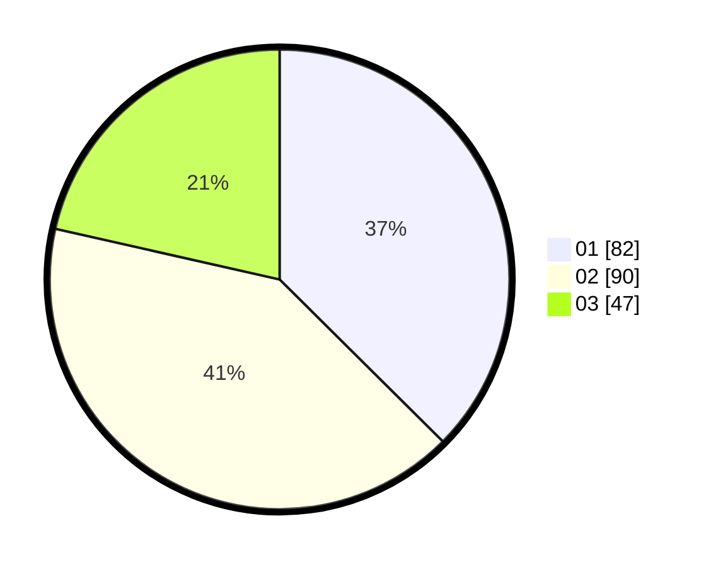

# Hasil

Hasil perolehan suara paslon dapat dilihat pada file paslon-01.txt, paslon-02.txt, dan paslon-03.txt.

Jika tidak ada, artinya data tersebut belum ada pada SIREKAP.

## Perolehan Suara

 * Paslon 01: **82**.
 * Paslon 02: **90**.
 * Paslon 03: **47**.

## Foto C Plano

https://sirekap-obj-formc.kpu.go.id/756e/pemilu/ppwp/31/75/02/10/07/3175021007107-20240214-221805--5b739650-37a2-43e7-b179-afba69f8c039.jpg

https://sirekap-obj-formc.kpu.go.id/756e/pemilu/ppwp/31/75/02/10/07/3175021007107-20240214-221829--ce7fda6b-a440-4c33-be25-c32365a9e6c4.jpg

https://sirekap-obj-formc.kpu.go.id/756e/pemilu/ppwp/31/75/02/10/07/3175021007107-20240214-221815--9c08acf4-68c2-400e-9298-9c892079485a.jpg

## DATA PEMILIH TETAP

Jumlah pemilih dalam DPT: **285**.
 * L: **136**.
 * P: **149**.

## DATA PENGGUNA HAK PILIH

Jumlah pengguna hak pilih dalam DPT: **211**.
 * L: **99**.
 * P: **112**.

Jumlah pengguna hak pilih dalam DPTb: **7**.
 * L: **2**.
 * P: **5**.

Jumlah pengguna hak pilih dalam DPK: **3**.
 * L: **2**.
 * P: **1**.

Jumlah pengguna hak pilih: **221**.
 * L: **103**.
 * P: **118**.

## JUMLAH SUARA SAH DAN TIDAK SAH

JUMLAH SELURUH SUARA SAH: **219**.

JUMLAH SUARA TIDAK SAH: **2**.

JUMLAH SELURUH SUARA SAH DAN SUARA TIDAK SAH: **221**.
