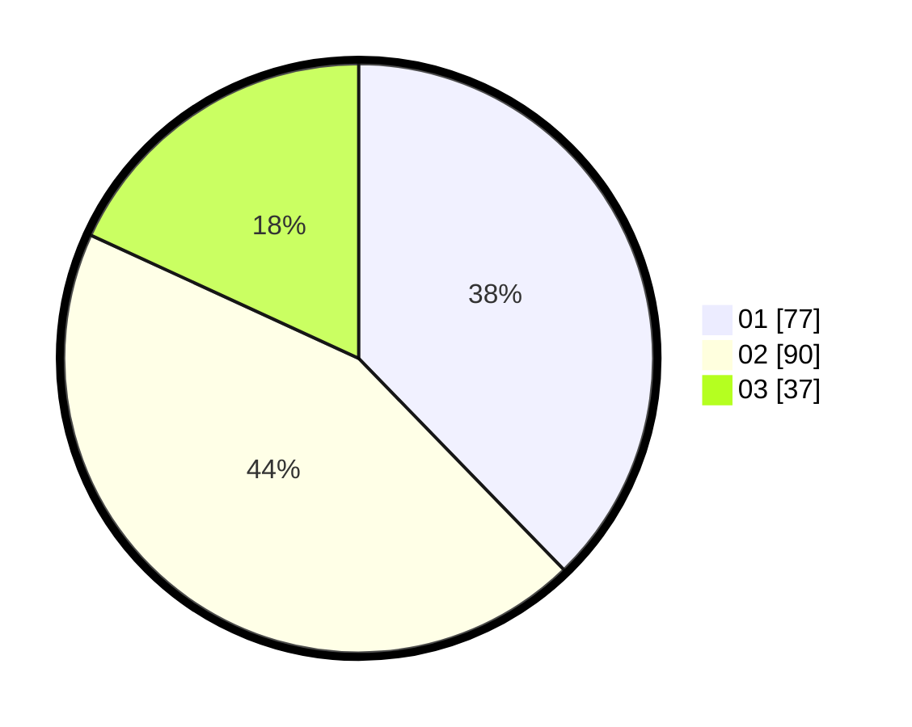

# Hasil

Hasil perolehan suara paslon dapat dilihat pada file paslon-01.txt, paslon-02.txt, dan paslon-03.txt.

Jika tidak ada, artinya data tersebut belum ada pada SIREKAP.

## Perolehan Suara

 * Paslon 01: **77**.
 * Paslon 02: **90**.
 * Paslon 03: **37**.

## Foto C Plano

https://sirekap-obj-formc.kpu.go.id/b4e8/pemilu/ppwp/31/75/03/10/01/3175031001002-20240214-235539--6eab8af2-9374-47cf-9758-9601ca5b6d75.jpg

https://sirekap-obj-formc.kpu.go.id/b4e8/pemilu/ppwp/31/75/03/10/01/3175031001002-20240214-235652--dc441d15-c383-4ddb-bf1a-2ea5f90d2aba.jpg

https://sirekap-obj-formc.kpu.go.id/b4e8/pemilu/ppwp/31/75/03/10/01/3175031001002-20240214-235912--20f4c74c-e912-4e84-af74-f570986503be.jpg
