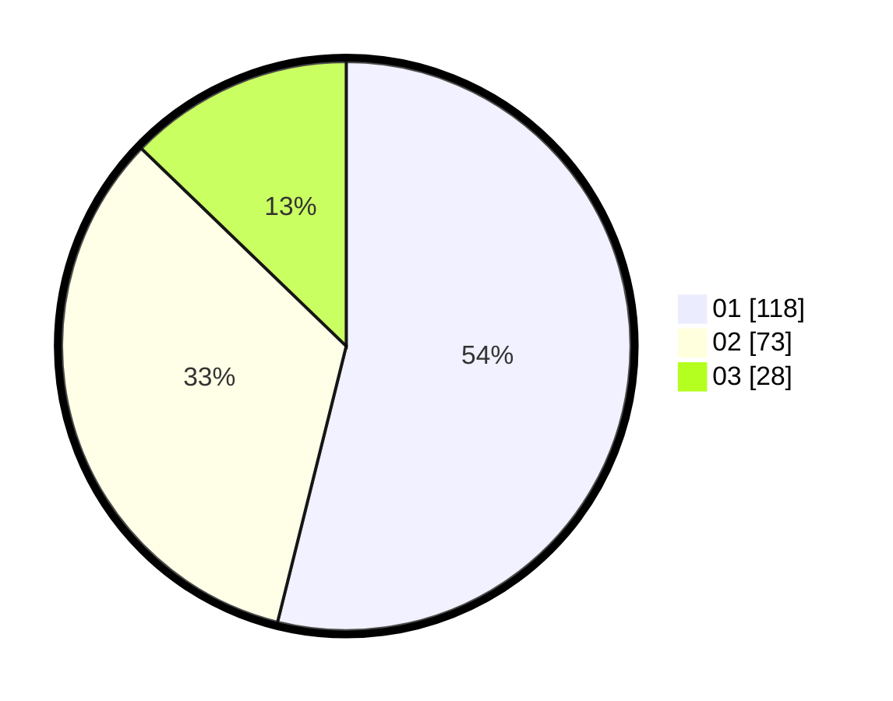

# Hasil

Hasil perolehan suara paslon dapat dilihat pada file paslon-01.txt, paslon-02.txt, dan paslon-03.txt.

Jika tidak ada, artinya data tersebut belum ada pada SIREKAP.

## Perolehan Suara

 * Paslon 01: **118**.
 * Paslon 02: **73**.
 * Paslon 03: **28**.

## Foto C Plano

https://sirekap-obj-formc.kpu.go.id/4b25/pemilu/ppwp/31/75/03/10/01/3175031001003-20240214-191926--9b5a0017-6fd6-49e2-b98e-6b2b257bcba9.jpg

https://sirekap-obj-formc.kpu.go.id/4b25/pemilu/ppwp/31/75/03/10/01/3175031001003-20240214-191948--8511bc37-f978-434d-a316-6d8c1ea7054d.jpg

https://sirekap-obj-formc.kpu.go.id/4b25/pemilu/ppwp/31/75/03/10/01/3175031001003-20240215-020226--cd989326-3fef-45ec-9b82-94315df95642.jpg

## DATA PEMILIH TETAP

Jumlah pemilih dalam DPT: **297**.
 * L: **150**.
 * P: **147**.

## DATA PENGGUNA HAK PILIH

Jumlah pengguna hak pilih dalam DPT: **219**.
 * L: **104**.
 * P: **115**.

Jumlah pengguna hak pilih dalam DPTb: **1**.
 * L: **0**.
 * P: **1**.

Jumlah pengguna hak pilih dalam DPK: **3**.
 * L: **1**.
 * P: **2**.

Jumlah pengguna hak pilih: **223**.
 * L: **105**.
 * P: **118**.

## JUMLAH SUARA SAH DAN TIDAK SAH
