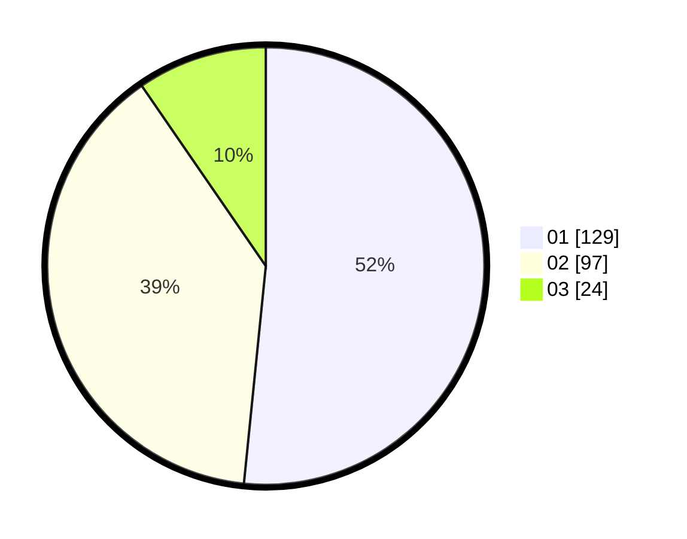

# Hasil

Hasil perolehan suara paslon dapat dilihat pada file paslon-01.txt, paslon-02.txt, dan paslon-03.txt.

Jika tidak ada, artinya data tersebut belum ada pada SIREKAP.

## Perolehan Suara

 * Paslon 01: **129**.
 * Paslon 02: **97**.
 * Paslon 03: **24**.

## Foto C Plano

https://sirekap-obj-formc.kpu.go.id/fbe0/pemilu/ppwp/31/75/03/10/01/3175031001004-20240214-202438--65c29c7c-7401-4a9a-98d3-f3b3617740bf.jpg

https://sirekap-obj-formc.kpu.go.id/fbe0/pemilu/ppwp/31/75/03/10/01/3175031001004-20240214-202519--8bdafac6-abd5-478f-82de-f46b147d902c.jpg

https://sirekap-obj-formc.kpu.go.id/fbe0/pemilu/ppwp/31/75/03/10/01/3175031001004-20240214-202603--09cfefc3-f921-46c5-bbc6-e5d7eb20389c.jpg
