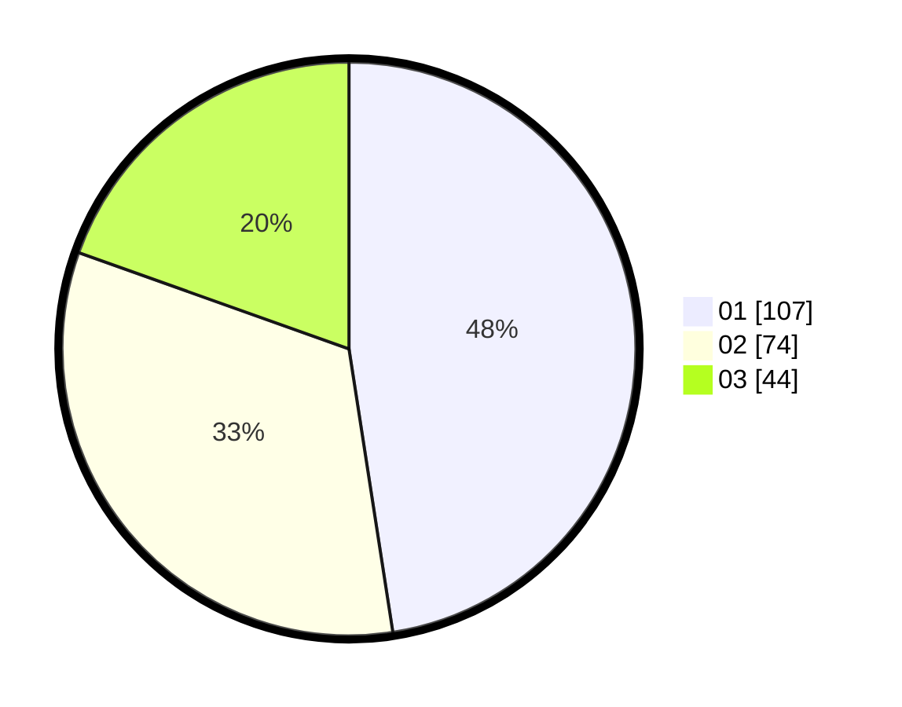

# Hasil

Hasil perolehan suara paslon dapat dilihat pada file paslon-01.txt, paslon-02.txt, dan paslon-03.txt.

Jika tidak ada, artinya data tersebut belum ada pada SIREKAP.

## Perolehan Suara

 * Paslon 01: **107**.
 * Paslon 02: **74**.
 * Paslon 03: **44**.

## Foto C Plano

https://sirekap-obj-formc.kpu.go.id/d042/pemilu/ppwp/31/75/03/10/01/3175031001005-20240214-191025--366d90a5-4513-4b90-90f0-706d7b2e9d68.jpg

https://sirekap-obj-formc.kpu.go.id/d042/pemilu/ppwp/31/75/03/10/01/3175031001005-20240214-191033--9edddc72-f673-4f25-bc8e-fca281dcbb6e.jpg

https://sirekap-obj-formc.kpu.go.id/d042/pemilu/ppwp/31/75/03/10/01/3175031001005-20240214-183202--c3403142-6ffc-4cab-afbe-1d4cf2a0be3b.jpg

## DATA PEMILIH TETAP

Jumlah pemilih dalam DPT: **293**.
 * L: **129**.
 * P: **164**.

## DATA PENGGUNA HAK PILIH

Jumlah pengguna hak pilih dalam DPT: **200**.
 * L: **94**.
 * P: **106**.

Jumlah pengguna hak pilih dalam DPTb: **19**.
 * L: **0**.
 * P: **19**.

Jumlah pengguna hak pilih dalam DPK: **1**.
 * L: **0**.
 * P: **1**.

Jumlah pengguna hak pilih: **220**.
 * L: **94**.
 * P: **126**.

## JUMLAH SUARA SAH DAN TIDAK SAH

JUMLAH SELURUH SUARA SAH: **225**.

JUMLAH SUARA TIDAK SAH: **0**.

JUMLAH SELURUH SUARA SAH DAN SUARA TIDAK SAH: **225**.
