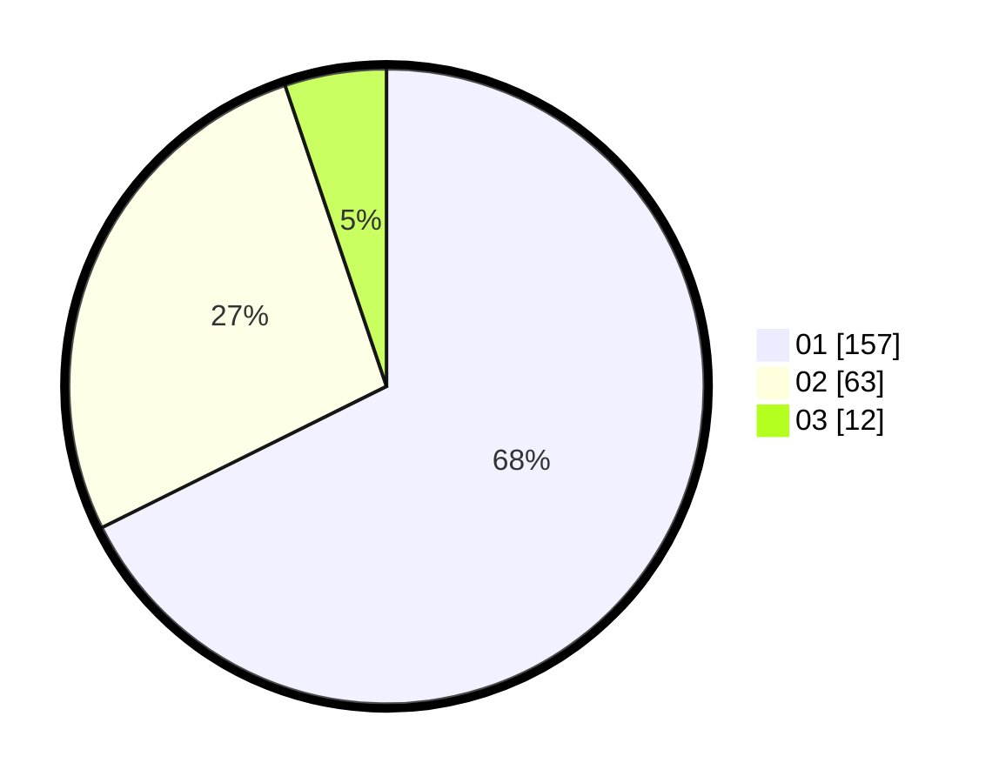

# Hasil

Hasil perolehan suara paslon dapat dilihat pada file paslon-01.txt, paslon-02.txt, dan paslon-03.txt.

Jika tidak ada, artinya data tersebut belum ada pada SIREKAP.

## Perolehan Suara

 * Paslon 01: **157**.
 * Paslon 02: **63**.
 * Paslon 03: **12**.

## Foto C Plano

https://sirekap-obj-formc.kpu.go.id/9962/pemilu/ppwp/31/75/03/10/01/3175031001006-20240214-224321--1c576302-d7f0-4ba1-a7ca-639bdafd7b0f.jpg

https://sirekap-obj-formc.kpu.go.id/9962/pemilu/ppwp/31/75/03/10/01/3175031001006-20240214-225159--5f801229-1c2e-43c9-a7e5-58aaae5e0f89.jpg

https://sirekap-obj-formc.kpu.go.id/9962/pemilu/ppwp/31/75/03/10/01/3175031001006-20240214-225324--771cf849-5958-49c3-8fa1-0ac05e53d273.jpg
