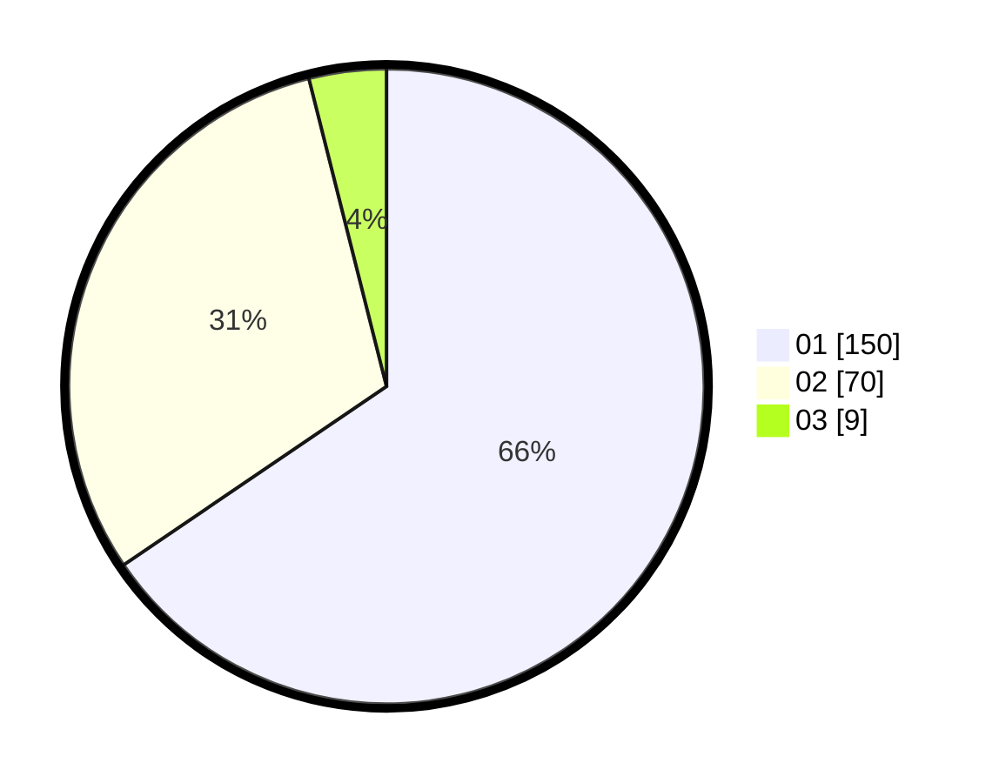

# Hasil

Hasil perolehan suara paslon dapat dilihat pada file paslon-01.txt, paslon-02.txt, dan paslon-03.txt.

Jika tidak ada, artinya data tersebut belum ada pada SIREKAP.

## Perolehan Suara

 * Paslon 01: **150**.
 * Paslon 02: **70**.
 * Paslon 03: **9**.

## Foto C Plano

https://sirekap-obj-formc.kpu.go.id/6021/pemilu/ppwp/31/75/03/10/01/3175031001011-20240215-205852--a8317a00-cb6c-4522-95eb-a758d4f685aa.jpg

https://sirekap-obj-formc.kpu.go.id/6021/pemilu/ppwp/31/75/03/10/01/3175031001011-20240215-205854--58aa35c0-22ec-4aec-8831-c0f89e6b4592.jpg

https://sirekap-obj-formc.kpu.go.id/6021/pemilu/ppwp/31/75/03/10/01/3175031001011-20240215-205854--f09c667f-545c-4fa2-807e-f37fdc09274d.jpg

## DATA PEMILIH TETAP

Jumlah pemilih dalam DPT: **277**.
 * L: **142**.
 * P: **135**.

## DATA PENGGUNA HAK PILIH

Jumlah pengguna hak pilih dalam DPT: **235**.
 * L: **117**.
 * P: **118**.

Jumlah pengguna hak pilih dalam DPTb: **0**.
 * L: **0**.
 * P: **0**.

Jumlah pengguna hak pilih dalam DPK: **1**.
 * L: **0**.
 * P: **1**.

Jumlah pengguna hak pilih: **236**.
 * L: **117**.
 * P: **119**.

## JUMLAH SUARA SAH DAN TIDAK SAH

JUMLAH SELURUH SUARA SAH: **229**.

JUMLAH SUARA TIDAK SAH: **7**.

JUMLAH SELURUH SUARA SAH DAN SUARA TIDAK SAH: **236**.
