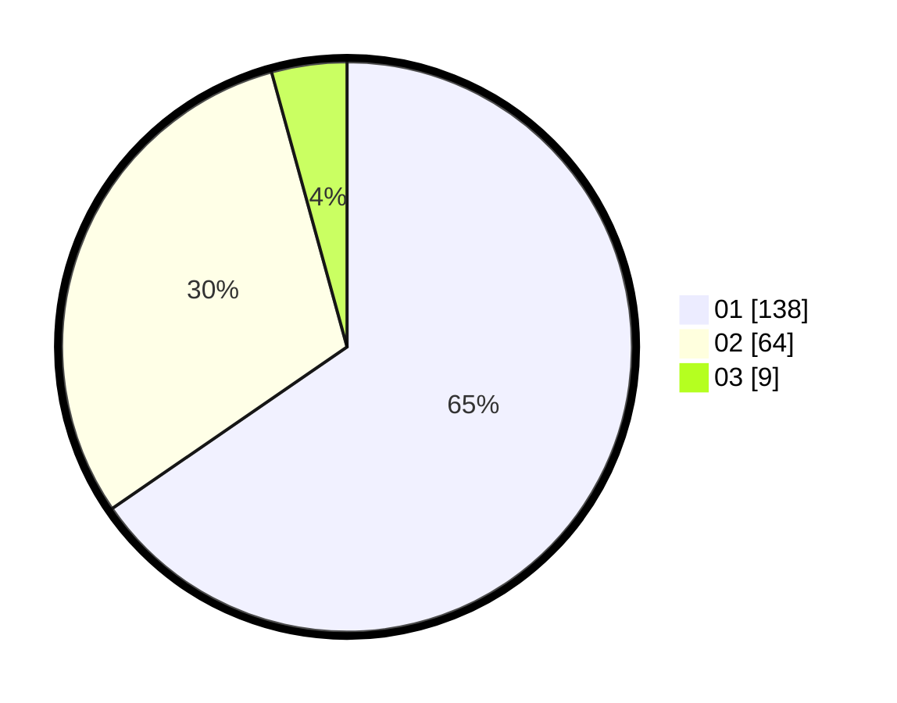

# Hasil

Hasil perolehan suara paslon dapat dilihat pada file paslon-01.txt, paslon-02.txt, dan paslon-03.txt.

Jika tidak ada, artinya data tersebut belum ada pada SIREKAP.

## Perolehan Suara

 * Paslon 01: **138**.
 * Paslon 02: **64**.
 * Paslon 03: **9**.

## Foto C Plano

https://sirekap-obj-formc.kpu.go.id/9f05/pemilu/ppwp/31/75/03/10/01/3175031001014-20240216-224059--7cb03bae-1556-4e65-adbb-a39d687624a3.jpg

https://sirekap-obj-formc.kpu.go.id/9f05/pemilu/ppwp/31/75/03/10/01/3175031001014-20240216-232651--16f25b0c-431e-4304-9750-96e1012c0b48.jpg

https://sirekap-obj-formc.kpu.go.id/9f05/pemilu/ppwp/31/75/03/10/01/3175031001014-20240216-233527--577a37f2-cb90-4144-8f6b-3706b474c93c.jpg

## DATA PEMILIH TETAP

Jumlah pemilih dalam DPT: **285**.
 * L: **141**.
 * P: **144**.

## DATA PENGGUNA HAK PILIH

Jumlah pengguna hak pilih dalam DPT: **214**.
 * L: **100**.
 * P: **114**.

Jumlah pengguna hak pilih dalam DPTb: **1**.
 * L: **0**.
 * P: **1**.

Jumlah pengguna hak pilih dalam DPK: **1**.
 * L: **0**.
 * P: **1**.

Jumlah pengguna hak pilih: **216**.
 * L: **100**.
 * P: **116**.

## JUMLAH SUARA SAH DAN TIDAK SAH

JUMLAH SELURUH SUARA SAH: **211**.

JUMLAH SUARA TIDAK SAH: **5**.

JUMLAH SELURUH SUARA SAH DAN SUARA TIDAK SAH: **216**.
