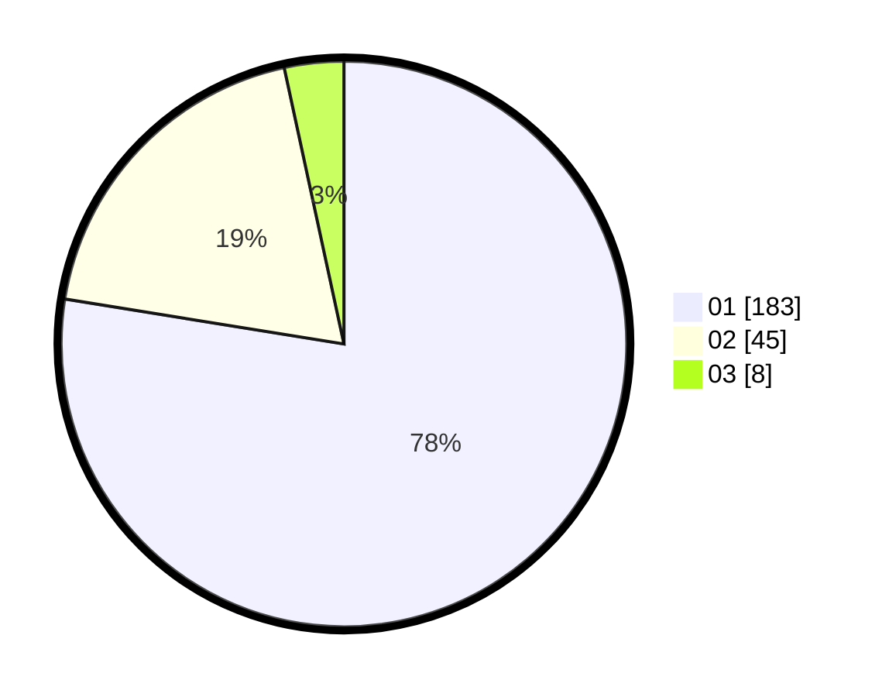

# Hasil

Hasil perolehan suara paslon dapat dilihat pada file paslon-01.txt, paslon-02.txt, dan paslon-03.txt.

Jika tidak ada, artinya data tersebut belum ada pada SIREKAP.

## Perolehan Suara

 * Paslon 01: **183**.
 * Paslon 02: **45**.
 * Paslon 03: **8**.

## Foto C Plano

https://sirekap-obj-formc.kpu.go.id/fda6/pemilu/ppwp/31/75/03/10/01/3175031001018-20240215-231010--d3aac53b-aca2-473e-993c-c024abc1f663.jpg

https://sirekap-obj-formc.kpu.go.id/fda6/pemilu/ppwp/31/75/03/10/01/3175031001018-20240215-231015--bcff2ff5-1328-4a38-9142-e0538849d160.jpg

https://sirekap-obj-formc.kpu.go.id/fda6/pemilu/ppwp/31/75/03/10/01/3175031001018-20240215-231012--2385b7c1-f36a-4ab9-9686-c90706ed4591.jpg

## DATA PEMILIH TETAP

Jumlah pemilih dalam DPT: **289**.
 * L: **154**.
 * P: **135**.

## DATA PENGGUNA HAK PILIH

Jumlah pengguna hak pilih dalam DPT: **234**.
 * L: **120**.
 * P: **114**.

Jumlah pengguna hak pilih dalam DPTb: **1**.
 * L: **0**.
 * P: **1**.

Jumlah pengguna hak pilih dalam DPK: **2**.
 * L: **2**.
 * P: **0**.

Jumlah pengguna hak pilih: **237**.
 * L: **122**.
 * P: **115**.

## JUMLAH SUARA SAH DAN TIDAK SAH

JUMLAH SELURUH SUARA SAH: **236**.

JUMLAH SUARA TIDAK SAH: **1**.

JUMLAH SELURUH SUARA SAH DAN SUARA TIDAK SAH: **237**.
