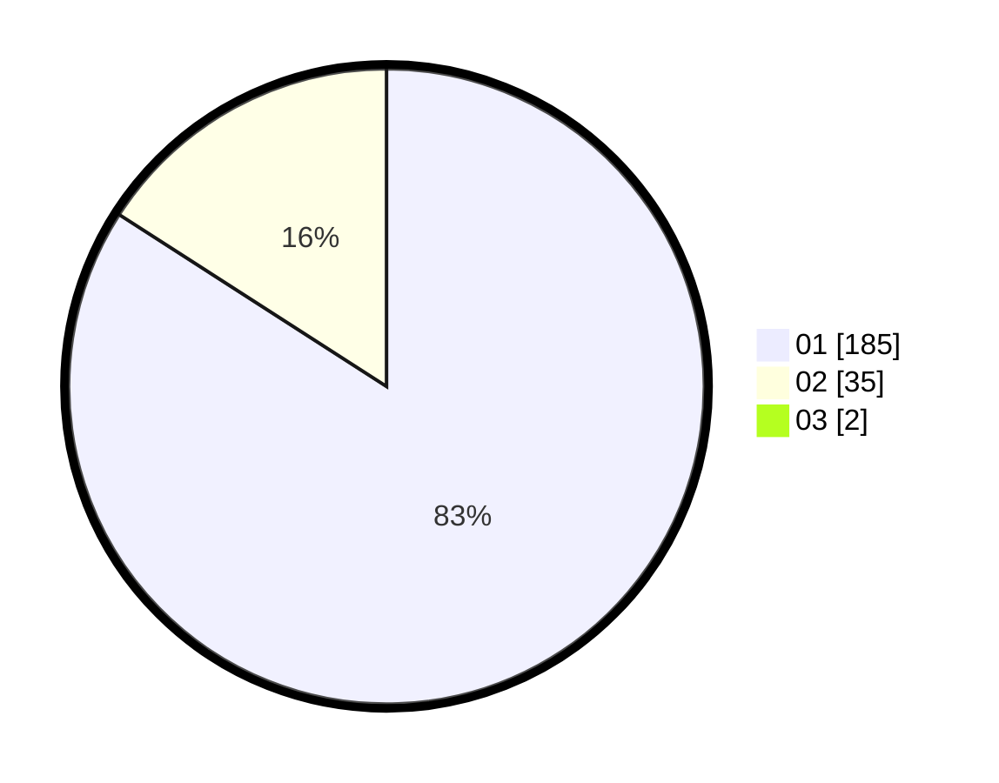

# Hasil

Hasil perolehan suara paslon dapat dilihat pada file paslon-01.txt, paslon-02.txt, dan paslon-03.txt.

Jika tidak ada, artinya data tersebut belum ada pada SIREKAP.

## Perolehan Suara

 * Paslon 01: **185**.
 * Paslon 02: **35**.
 * Paslon 03: **2**.

## Foto C Plano

https://sirekap-obj-formc.kpu.go.id/b4aa/pemilu/ppwp/31/75/03/10/01/3175031001023-20240214-200517--d4e9e39d-4ca6-43a3-b773-2f59c5dddf0a.jpg

https://sirekap-obj-formc.kpu.go.id/b4aa/pemilu/ppwp/31/75/03/10/01/3175031001023-20240214-200330--24eb99fe-05ba-4ab3-96f7-d27b8285ae92.jpg

https://sirekap-obj-formc.kpu.go.id/b4aa/pemilu/ppwp/31/75/03/10/01/3175031001023-20240214-200802--60461579-9e6e-48c5-9ddc-34b9188d16c3.jpg

## DATA PEMILIH TETAP

Jumlah pemilih dalam DPT: **226**.
 * L: **121**.
 * P: **105**.

## DATA PENGGUNA HAK PILIH

Jumlah pengguna hak pilih dalam DPT: **226**.
 * L: **121**.
 * P: **105**.

Jumlah pengguna hak pilih dalam DPTb: **1**.
 * L: **0**.
 * P: **1**.

Jumlah pengguna hak pilih dalam DPK: **0**.
 * L: **0**.
 * P: **0**.

Jumlah pengguna hak pilih: **227**.
 * L: **121**.
 * P: **106**.

## JUMLAH SUARA SAH DAN TIDAK SAH

JUMLAH SELURUH SUARA SAH: **222**.

JUMLAH SUARA TIDAK SAH: **5**.

JUMLAH SELURUH SUARA SAH DAN SUARA TIDAK SAH: **227**.
