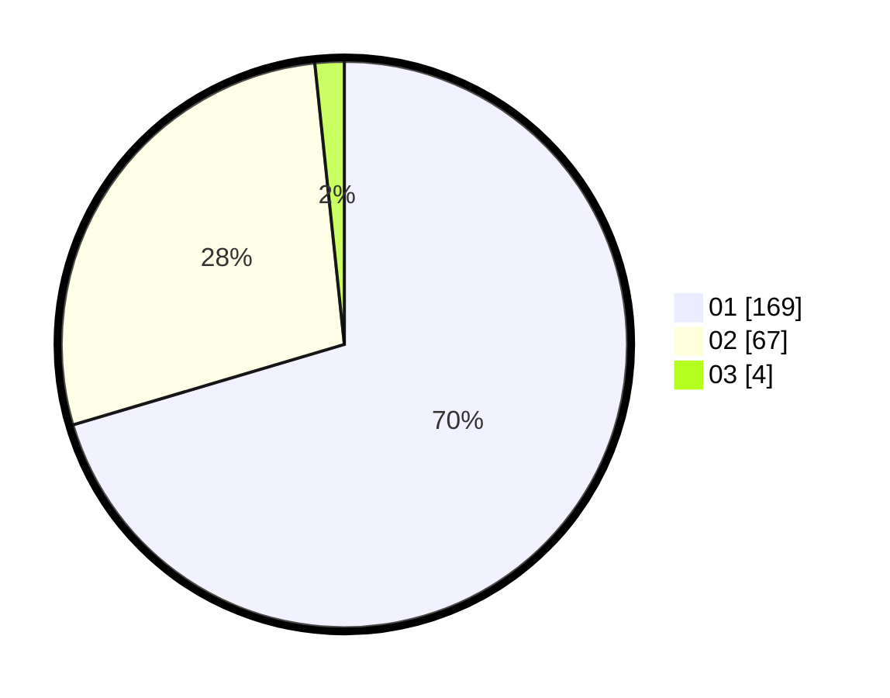

# Hasil

Hasil perolehan suara paslon dapat dilihat pada file paslon-01.txt, paslon-02.txt, dan paslon-03.txt.

Jika tidak ada, artinya data tersebut belum ada pada SIREKAP.

## Perolehan Suara

 * Paslon 01: **169**.
 * Paslon 02: **67**.
 * Paslon 03: **4**.

## Foto C Plano

https://sirekap-obj-formc.kpu.go.id/c59c/pemilu/ppwp/31/75/03/10/01/3175031001024-20240215-205921--6c412b4b-9d75-4e78-b250-bc1656c632a2.jpg

https://sirekap-obj-formc.kpu.go.id/c59c/pemilu/ppwp/31/75/03/10/01/3175031001024-20240215-205923--634785d3-6b2b-43c9-b180-a33712e67e95.jpg

https://sirekap-obj-formc.kpu.go.id/c59c/pemilu/ppwp/31/75/03/10/01/3175031001024-20240215-205922--1cd3f608-f5e1-4353-89a1-fa51a07bf92d.jpg

## DATA PEMILIH TETAP

Jumlah pemilih dalam DPT: **240**.
 * L: **117**.
 * P: **122**.

## DATA PENGGUNA HAK PILIH

Jumlah pengguna hak pilih dalam DPT: **0**.
 * L: **0**.
 * P: **1**.

Jumlah pengguna hak pilih dalam DPTb: **0**.
 * L: **0**.
 * P: **1**.

Jumlah pengguna hak pilih dalam DPK: **0**.
 * L: **0**.
 * P: **0**.

Jumlah pengguna hak pilih: **0**.
 * L: **0**.
 * P: **0**.

## JUMLAH SUARA SAH DAN TIDAK SAH

JUMLAH SELURUH SUARA SAH: **240**.

JUMLAH SUARA TIDAK SAH: **0**.

JUMLAH SELURUH SUARA SAH DAN SUARA TIDAK SAH: **240**.
