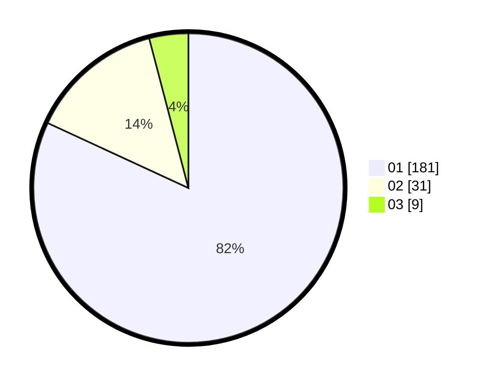

# Hasil

Hasil perolehan suara paslon dapat dilihat pada file paslon-01.txt, paslon-02.txt, dan paslon-03.txt.

Jika tidak ada, artinya data tersebut belum ada pada SIREKAP.

## Perolehan Suara

 * Paslon 01: **181**.
 * Paslon 02: **31**.
 * Paslon 03: **9**.

## Foto C Plano

https://sirekap-obj-formc.kpu.go.id/97ee/pemilu/ppwp/31/75/03/10/01/3175031001027-20240214-194407--236e1e43-6441-43b8-9b3e-77e99188d425.jpg

https://sirekap-obj-formc.kpu.go.id/97ee/pemilu/ppwp/31/75/03/10/01/3175031001027-20240214-194438--9d4ecf92-ccf4-404e-97bf-ab6c6fcd47c2.jpg

https://sirekap-obj-formc.kpu.go.id/97ee/pemilu/ppwp/31/75/03/10/01/3175031001027-20240214-194448--4bd1e87b-4b72-4be2-a2bf-f94acf8c9482.jpg
