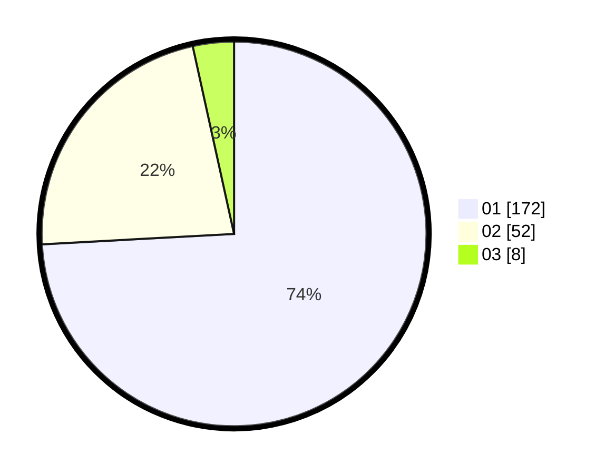

# Hasil

Hasil perolehan suara paslon dapat dilihat pada file paslon-01.txt, paslon-02.txt, dan paslon-03.txt.

Jika tidak ada, artinya data tersebut belum ada pada SIREKAP.

## Perolehan Suara

 * Paslon 01: **172**.
 * Paslon 02: **52**.
 * Paslon 03: **8**.

## Foto C Plano

https://sirekap-obj-formc.kpu.go.id/916b/pemilu/ppwp/31/75/03/10/01/3175031001028-20240216-134017--f842e1df-1740-4696-8c94-8177b1d87101.jpg

https://sirekap-obj-formc.kpu.go.id/916b/pemilu/ppwp/31/75/03/10/01/3175031001028-20240216-134018--a95f184b-50ca-4b32-9377-1e611ed14de6.jpg

https://sirekap-obj-formc.kpu.go.id/916b/pemilu/ppwp/31/75/03/10/01/3175031001028-20240216-134017--24508900-7019-4354-99f9-267193307a61.jpg

## DATA PEMILIH TETAP

Jumlah pemilih dalam DPT: **275**.
 * L: **141**.
 * P: **134**.

## DATA PENGGUNA HAK PILIH

Jumlah pengguna hak pilih dalam DPT: **233**.
 * L: **120**.
 * P: **113**.

Jumlah pengguna hak pilih dalam DPTb: **0**.
 * L: **0**.
 * P: **0**.

Jumlah pengguna hak pilih dalam DPK: **0**.
 * L: **0**.
 * P: **0**.

Jumlah pengguna hak pilih: **233**.
 * L: **120**.
 * P: **113**.

## JUMLAH SUARA SAH DAN TIDAK SAH

JUMLAH SELURUH SUARA SAH: **232**.

JUMLAH SUARA TIDAK SAH: **1**.

JUMLAH SELURUH SUARA SAH DAN SUARA TIDAK SAH: **233**.
