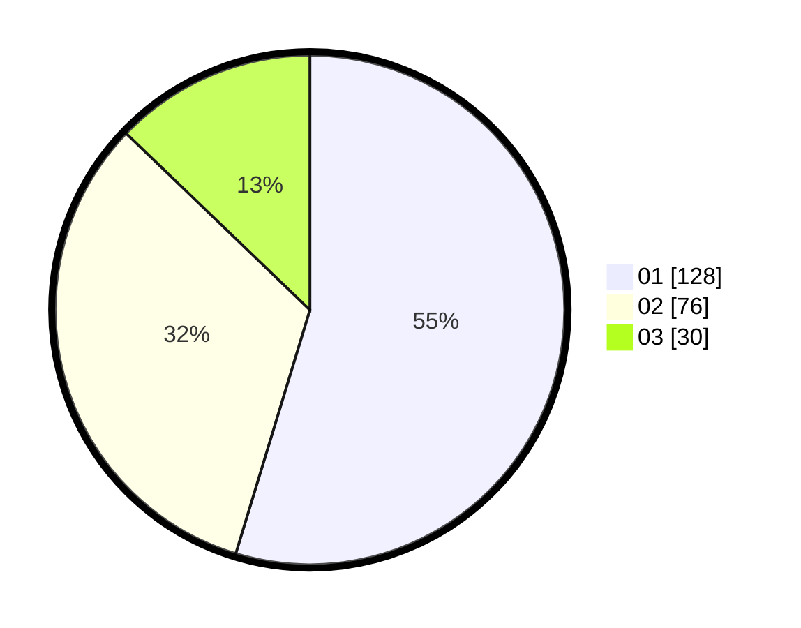

# Hasil

Hasil perolehan suara paslon dapat dilihat pada file paslon-01.txt, paslon-02.txt, dan paslon-03.txt.

Jika tidak ada, artinya data tersebut belum ada pada SIREKAP.

## Perolehan Suara

 * Paslon 01: **128**.
 * Paslon 02: **76**.
 * Paslon 03: **30**.

## Foto C Plano

https://sirekap-obj-formc.kpu.go.id/d713/pemilu/ppwp/31/75/03/10/01/3175031001030-20240215-234634--f67cc55a-d8e8-4212-9fc3-b5b02c5bf1e3.jpg

https://sirekap-obj-formc.kpu.go.id/d713/pemilu/ppwp/31/75/03/10/01/3175031001030-20240215-234637--bb7b974f-4f71-40cb-9e78-51cedc5be9bd.jpg

https://sirekap-obj-formc.kpu.go.id/d713/pemilu/ppwp/31/75/03/10/01/3175031001030-20240215-234635--4976cdfa-6fa1-4b81-adb1-6b866ac49dcf.jpg

## DATA PEMILIH TETAP

Jumlah pemilih dalam DPT: **286**.
 * L: **141**.
 * P: **145**.

## DATA PENGGUNA HAK PILIH

Jumlah pengguna hak pilih dalam DPT: **224**.
 * L: **110**.
 * P: **114**.

Jumlah pengguna hak pilih dalam DPTb: **2**.
 * L: **1**.
 * P: **1**.

Jumlah pengguna hak pilih dalam DPK: **9**.
 * L: **4**.
 * P: **5**.

Jumlah pengguna hak pilih: **235**.
 * L: **115**.
 * P: **120**.

## JUMLAH SUARA SAH DAN TIDAK SAH

JUMLAH SELURUH SUARA SAH: **234**.

JUMLAH SUARA TIDAK SAH: **1**.

JUMLAH SELURUH SUARA SAH DAN SUARA TIDAK SAH: **235**.
