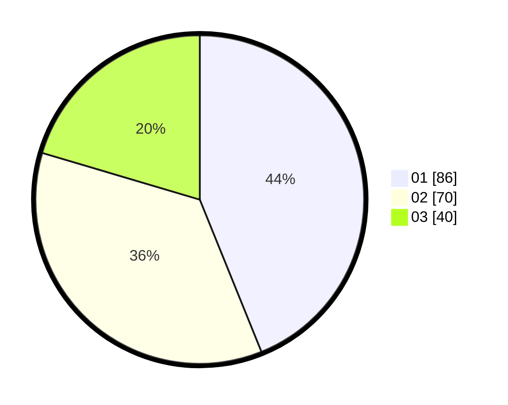

# Hasil

Hasil perolehan suara paslon dapat dilihat pada file paslon-01.txt, paslon-02.txt, dan paslon-03.txt.

Jika tidak ada, artinya data tersebut belum ada pada SIREKAP.

## Perolehan Suara

 * Paslon 01: **86**.
 * Paslon 02: **70**.
 * Paslon 03: **40**.

## Foto C Plano

https://sirekap-obj-formc.kpu.go.id/f8e3/pemilu/ppwp/31/75/03/10/01/3175031001032-20240214-215514--ab7b43c8-4ad5-45a8-90f4-37df8346bf7f.jpg

https://sirekap-obj-formc.kpu.go.id/f8e3/pemilu/ppwp/31/75/03/10/01/3175031001032-20240214-215521--b88bde4a-71b8-4ebf-a85d-3951ff307e9f.jpg

https://sirekap-obj-formc.kpu.go.id/f8e3/pemilu/ppwp/31/75/03/10/01/3175031001032-20240214-215528--e2092890-c7c2-43ff-b7cc-aca42ab40322.jpg
