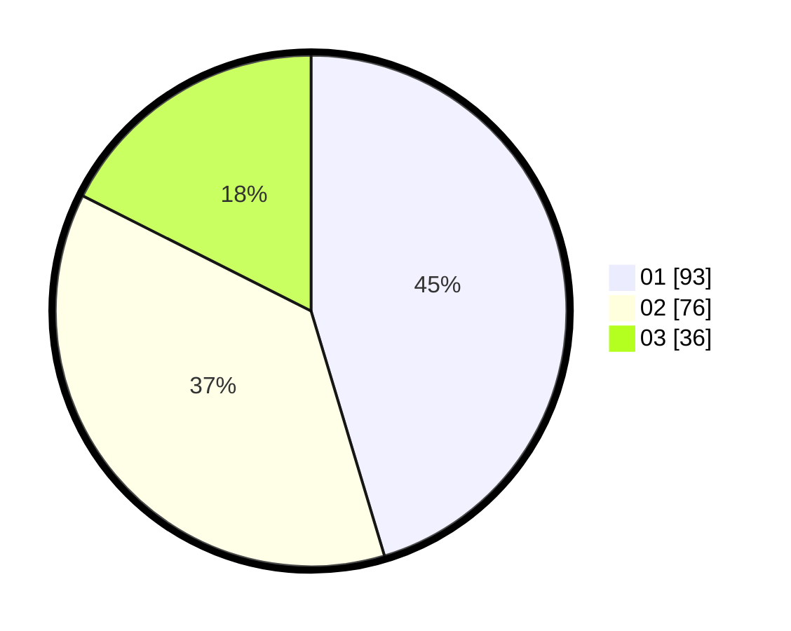

# Hasil

Hasil perolehan suara paslon dapat dilihat pada file paslon-01.txt, paslon-02.txt, dan paslon-03.txt.

Jika tidak ada, artinya data tersebut belum ada pada SIREKAP.

## Perolehan Suara

 * Paslon 01: **93**.
 * Paslon 02: **76**.
 * Paslon 03: **36**.

## Foto C Plano

https://sirekap-obj-formc.kpu.go.id/08c1/pemilu/ppwp/31/75/03/10/01/3175031001033-20240214-220346--a68f4fba-f092-43f2-b4bf-f1121d1e845c.jpg

https://sirekap-obj-formc.kpu.go.id/08c1/pemilu/ppwp/31/75/03/10/01/3175031001033-20240214-220229--3cdc1b49-bea0-4623-a22f-ec02fe7023cb.jpg

https://sirekap-obj-formc.kpu.go.id/08c1/pemilu/ppwp/31/75/03/10/01/3175031001033-20240214-220514--50914215-2cab-416a-b4f6-f5642f1e3377.jpg

## DATA PEMILIH TETAP

Jumlah pemilih dalam DPT: **251**.
 * L: **133**.
 * P: **118**.

## DATA PENGGUNA HAK PILIH

Jumlah pengguna hak pilih dalam DPT: **208**.
 * L: **102**.
 * P: **106**.

Jumlah pengguna hak pilih dalam DPTb: **1**.
 * L: **0**.
 * P: **1**.

Jumlah pengguna hak pilih dalam DPK: **1**.
 * L: **1**.
 * P: **0**.

Jumlah pengguna hak pilih: **210**.
 * L: **103**.
 * P: **107**.

## JUMLAH SUARA SAH DAN TIDAK SAH

JUMLAH SELURUH SUARA SAH: **205**.

JUMLAH SUARA TIDAK SAH: **5**.

JUMLAH SELURUH SUARA SAH DAN SUARA TIDAK SAH: **210**.
