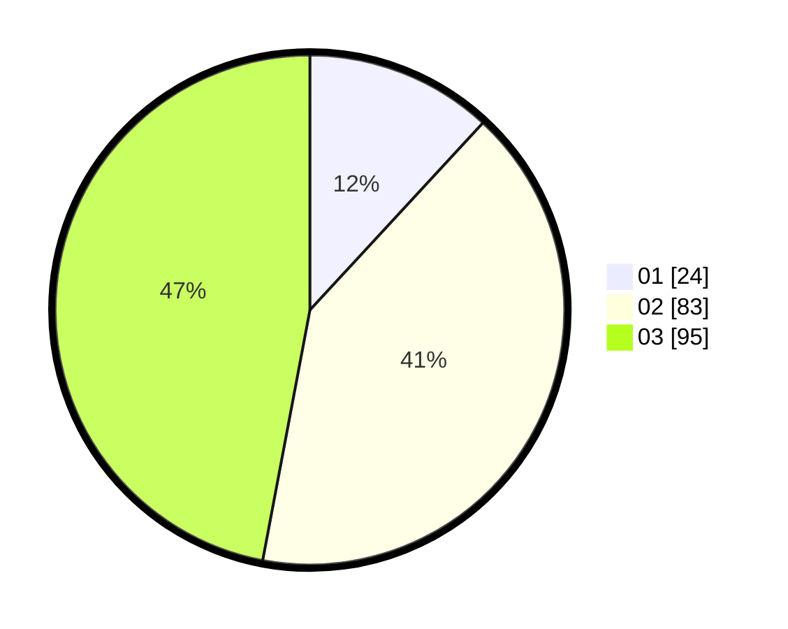

# Hasil

Hasil perolehan suara paslon dapat dilihat pada file paslon-01.txt, paslon-02.txt, dan paslon-03.txt.

Jika tidak ada, artinya data tersebut belum ada pada SIREKAP.

## Perolehan Suara

 * Paslon 01: **24**.
 * Paslon 02: **83**.
 * Paslon 03: **95**.

## Foto C Plano

https://sirekap-obj-formc.kpu.go.id/1bbd/pemilu/ppwp/31/75/03/10/01/3175031001035-20240216-034619--3368cc14-9891-40b9-b48f-ce5bf8788a07.jpg

https://sirekap-obj-formc.kpu.go.id/1bbd/pemilu/ppwp/31/75/03/10/01/3175031001035-20240214-155035--f0be1e12-19e9-4a59-b65e-613284fd7489.jpg

https://sirekap-obj-formc.kpu.go.id/1bbd/pemilu/ppwp/31/75/03/10/01/3175031001035-20240216-034620--c18dd478-d963-4efe-ba41-253bec028d47.jpg

## DATA PEMILIH TETAP

Jumlah pemilih dalam DPT: **0**.
 * L: **0**.
 * P: **0**.

## DATA PENGGUNA HAK PILIH

Jumlah pengguna hak pilih dalam DPT: **0**.
 * L: **0**.
 * P: **0**.

Jumlah pengguna hak pilih dalam DPTb: **0**.
 * L: **0**.
 * P: **0**.

Jumlah pengguna hak pilih dalam DPK: **0**.
 * L: **0**.
 * P: **0**.

Jumlah pengguna hak pilih: **0**.
 * L: **0**.
 * P: **0**.

## JUMLAH SUARA SAH DAN TIDAK SAH

JUMLAH SELURUH SUARA SAH: **0**.

JUMLAH SUARA TIDAK SAH: **0**.

JUMLAH SELURUH SUARA SAH DAN SUARA TIDAK SAH: **0**.
