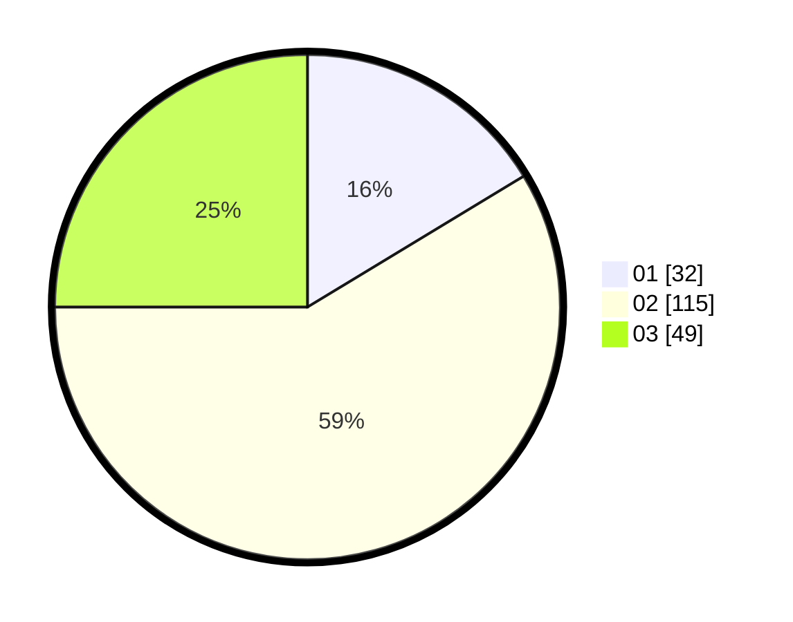

# Hasil

Hasil perolehan suara paslon dapat dilihat pada file paslon-01.txt, paslon-02.txt, dan paslon-03.txt.

Jika tidak ada, artinya data tersebut belum ada pada SIREKAP.

## Perolehan Suara

 * Paslon 01: **32**.
 * Paslon 02: **115**.
 * Paslon 03: **49**.

## Foto C Plano

https://sirekap-obj-formc.kpu.go.id/fc49/pemilu/ppwp/31/75/03/10/01/3175031001036-20240214-185548--083b5709-b67c-480f-8ff5-ad6a60485703.jpg

https://sirekap-obj-formc.kpu.go.id/fc49/pemilu/ppwp/31/75/03/10/01/3175031001036-20240214-185311--57e0a1ec-da07-45a1-a891-74542e9c80e2.jpg

https://sirekap-obj-formc.kpu.go.id/fc49/pemilu/ppwp/31/75/03/10/01/3175031001036-20240214-185203--8e33636c-7060-430a-9a12-f1140a447c36.jpg
