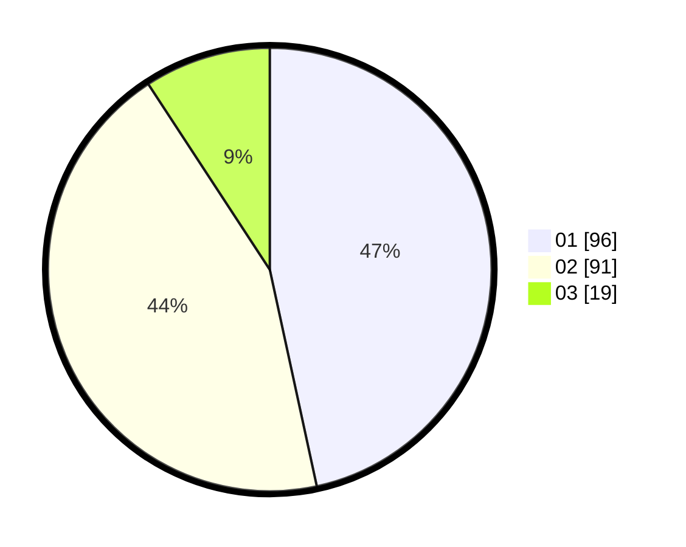

# Hasil

Hasil perolehan suara paslon dapat dilihat pada file paslon-01.txt, paslon-02.txt, dan paslon-03.txt.

Jika tidak ada, artinya data tersebut belum ada pada SIREKAP.

## Perolehan Suara

 * Paslon 01: **96**.
 * Paslon 02: **91**.
 * Paslon 03: **19**.

## Foto C Plano

https://sirekap-obj-formc.kpu.go.id/9924/pemilu/ppwp/31/75/03/10/01/3175031001039-20240217-111817--ceae676a-448b-4079-9142-8a96d32e4224.jpg

https://sirekap-obj-formc.kpu.go.id/9924/pemilu/ppwp/31/75/03/10/01/3175031001039-20240215-025808--018a9aa6-d80c-4177-812e-9a62b93c9866.jpg
