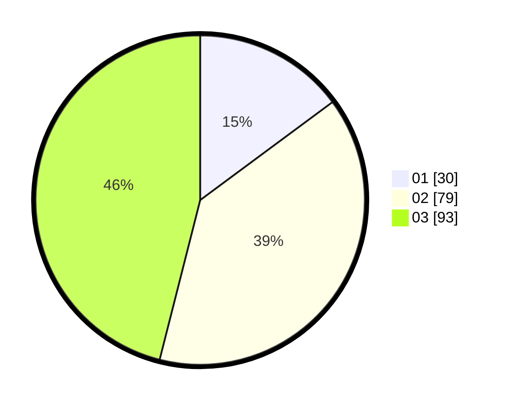

# Hasil

Hasil perolehan suara paslon dapat dilihat pada file paslon-01.txt, paslon-02.txt, dan paslon-03.txt.

Jika tidak ada, artinya data tersebut belum ada pada SIREKAP.

## Perolehan Suara

 * Paslon 01: **30**.
 * Paslon 02: **79**.
 * Paslon 03: **93**.

## Foto C Plano

https://sirekap-obj-formc.kpu.go.id/8f1c/pemilu/ppwp/31/75/03/10/01/3175031001041-20240217-093647--a9863932-dd56-4f1c-b666-3fc4e199aa9a.jpg

https://sirekap-obj-formc.kpu.go.id/8f1c/pemilu/ppwp/31/75/03/10/01/3175031001041-20240217-093648--b398b558-3037-43c8-8c2a-bf4f43a5ecbf.jpg

https://sirekap-obj-formc.kpu.go.id/8f1c/pemilu/ppwp/31/75/03/10/01/3175031001041-20240217-093647--011c4030-b3dc-41f1-ac96-d67d14b258cb.jpg

## DATA PEMILIH TETAP

Jumlah pemilih dalam DPT: **261**.
 * L: **127**.
 * P: **134**.

## DATA PENGGUNA HAK PILIH

Jumlah pengguna hak pilih dalam DPT: **194**.
 * L: **90**.
 * P: **104**.

Jumlah pengguna hak pilih dalam DPTb: **3**.
 * L: **1**.
 * P: **2**.

Jumlah pengguna hak pilih dalam DPK: **8**.
 * L: **3**.
 * P: **5**.

Jumlah pengguna hak pilih: **205**.
 * L: **94**.
 * P: **111**.

## JUMLAH SUARA SAH DAN TIDAK SAH

JUMLAH SELURUH SUARA SAH: **202**.

JUMLAH SUARA TIDAK SAH: **3**.

JUMLAH SELURUH SUARA SAH DAN SUARA TIDAK SAH: **205**.
