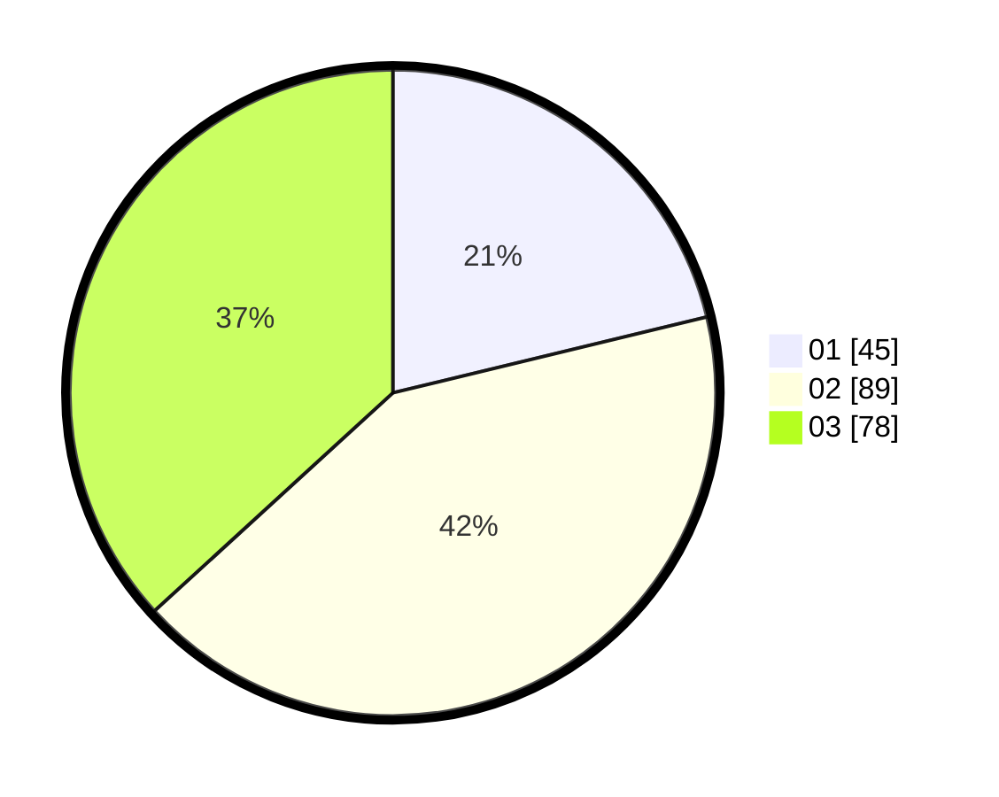

# Hasil

Hasil perolehan suara paslon dapat dilihat pada file paslon-01.txt, paslon-02.txt, dan paslon-03.txt.

Jika tidak ada, artinya data tersebut belum ada pada SIREKAP.

## Perolehan Suara

 * Paslon 01: **45**.
 * Paslon 02: **89**.
 * Paslon 03: **78**.

## Foto C Plano

https://sirekap-obj-formc.kpu.go.id/15ce/pemilu/ppwp/31/75/03/10/01/3175031001043-20240214-141609--c0fbd1af-098d-43b0-8f87-443f6dcca5ef.jpg

https://sirekap-obj-formc.kpu.go.id/15ce/pemilu/ppwp/31/75/03/10/01/3175031001043-20240214-141455--f3408ad7-c7e0-4c34-9e5d-4ae1fe924e0d.jpg

https://sirekap-obj-formc.kpu.go.id/15ce/pemilu/ppwp/31/75/03/10/01/3175031001043-20240214-141405--b74a1c65-cdb2-4c20-8acc-ad49b86348a7.jpg

## DATA PEMILIH TETAP

Jumlah pemilih dalam DPT: **258**.
 * L: **130**.
 * P: **128**.

## DATA PENGGUNA HAK PILIH

Jumlah pengguna hak pilih dalam DPT: **212**.
 * L: **111**.
 * P: **101**.

Jumlah pengguna hak pilih dalam DPTb: **3**.
 * L: **1**.
 * P: **2**.

Jumlah pengguna hak pilih dalam DPK: **2**.
 * L: **1**.
 * P: **1**.

Jumlah pengguna hak pilih: **217**.
 * L: **113**.
 * P: **104**.

## JUMLAH SUARA SAH DAN TIDAK SAH

JUMLAH SELURUH SUARA SAH: **212**.

JUMLAH SUARA TIDAK SAH: **5**.

JUMLAH SELURUH SUARA SAH DAN SUARA TIDAK SAH: **217**.
