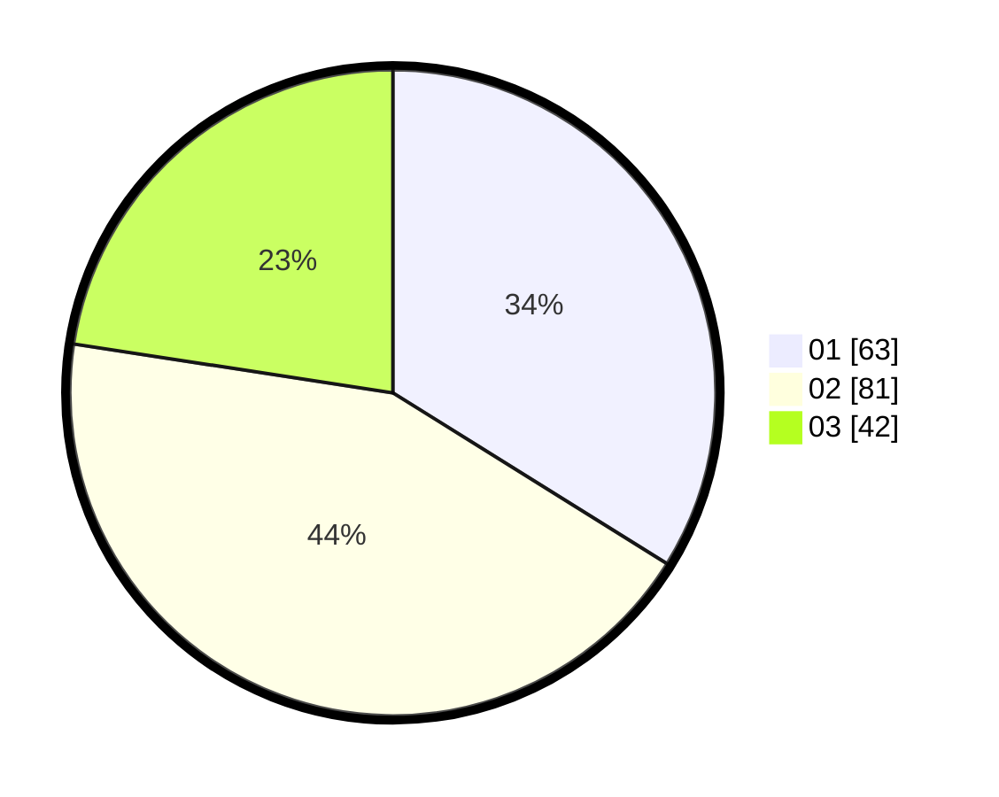

# Hasil

Hasil perolehan suara paslon dapat dilihat pada file paslon-01.txt, paslon-02.txt, dan paslon-03.txt.

Jika tidak ada, artinya data tersebut belum ada pada SIREKAP.

## Perolehan Suara

 * Paslon 01: **63**.
 * Paslon 02: **81**.
 * Paslon 03: **42**.

## Foto C Plano

https://sirekap-obj-formc.kpu.go.id/11d7/pemilu/ppwp/31/75/03/10/01/3175031001044-20240217-102239--3371ff16-d4c8-41d2-a573-e579ff9335da.jpg

https://sirekap-obj-formc.kpu.go.id/11d7/pemilu/ppwp/31/75/03/10/01/3175031001044-20240217-102240--1dbeb7ca-d266-45bd-a84b-c714ba49a9ab.jpg

https://sirekap-obj-formc.kpu.go.id/11d7/pemilu/ppwp/31/75/03/10/01/3175031001044-20240217-102240--dc991c89-b90a-4081-a86e-fb8a77f6bd12.jpg

## DATA PEMILIH TETAP

Jumlah pemilih dalam DPT: **257**.
 * L: **130**.
 * P: **127**.

## DATA PENGGUNA HAK PILIH

Jumlah pengguna hak pilih dalam DPT: **185**.
 * L: **88**.
 * P: **97**.

Jumlah pengguna hak pilih dalam DPTb: **0**.
 * L: **0**.
 * P: **0**.

Jumlah pengguna hak pilih dalam DPK: **4**.
 * L: **2**.
 * P: **2**.

Jumlah pengguna hak pilih: **189**.
 * L: **90**.
 * P: **99**.

## JUMLAH SUARA SAH DAN TIDAK SAH

JUMLAH SELURUH SUARA SAH: **186**.

JUMLAH SUARA TIDAK SAH: **3**.

JUMLAH SELURUH SUARA SAH DAN SUARA TIDAK SAH: **189**.
