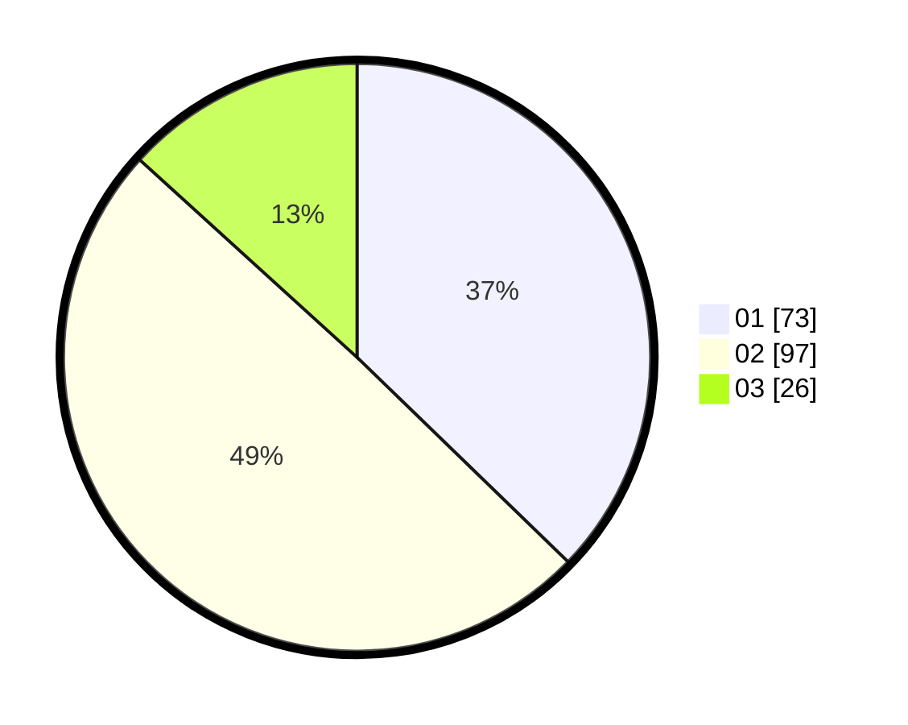

# Hasil

Hasil perolehan suara paslon dapat dilihat pada file paslon-01.txt, paslon-02.txt, dan paslon-03.txt.

Jika tidak ada, artinya data tersebut belum ada pada SIREKAP.

## Perolehan Suara

 * Paslon 01: **73**.
 * Paslon 02: **97**.
 * Paslon 03: **26**.

## Foto C Plano

https://sirekap-obj-formc.kpu.go.id/f6f9/pemilu/ppwp/31/75/03/10/01/3175031001045-20240215-132851--057424cc-6377-479f-9fcc-537ea7a6f768.jpg

https://sirekap-obj-formc.kpu.go.id/f6f9/pemilu/ppwp/31/75/03/10/01/3175031001045-20240215-132912--8e99d4f9-2cbb-4bf1-a24e-e464b0a63cfc.jpg

https://sirekap-obj-formc.kpu.go.id/f6f9/pemilu/ppwp/31/75/03/10/01/3175031001045-20240215-132902--e54b1780-6fee-4a5e-88fa-ef5e73273874.jpg

## DATA PEMILIH TETAP

Jumlah pemilih dalam DPT: **272**.
 * L: **141**.
 * P: **131**.

## DATA PENGGUNA HAK PILIH

Jumlah pengguna hak pilih dalam DPT: **201**.
 * L: **96**.
 * P: **105**.

Jumlah pengguna hak pilih dalam DPTb: **0**.
 * L: **0**.
 * P: **0**.

Jumlah pengguna hak pilih dalam DPK: **4**.
 * L: **2**.
 * P: **2**.

Jumlah pengguna hak pilih: **205**.
 * L: **98**.
 * P: **107**.

## JUMLAH SUARA SAH DAN TIDAK SAH

JUMLAH SELURUH SUARA SAH: **196**.

JUMLAH SUARA TIDAK SAH: **9**.

JUMLAH SELURUH SUARA SAH DAN SUARA TIDAK SAH: **205**.
