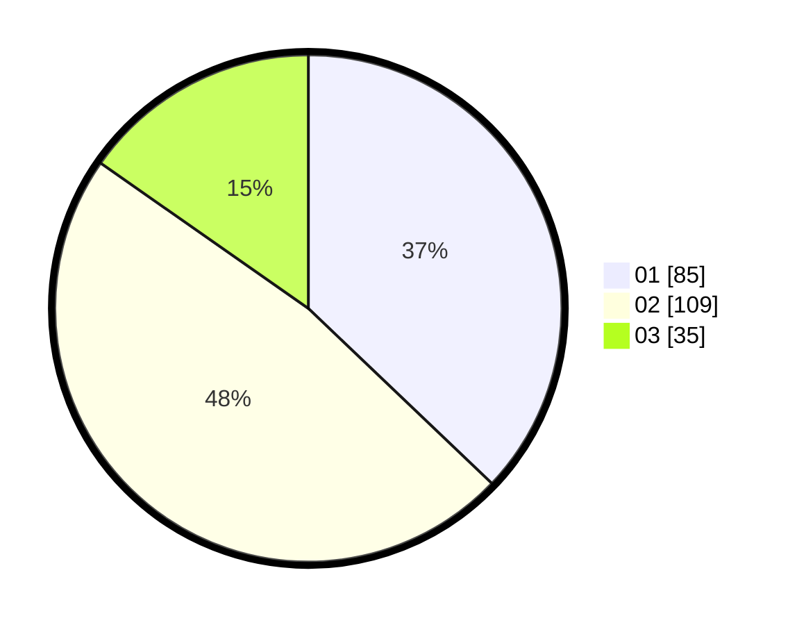

# Hasil

Hasil perolehan suara paslon dapat dilihat pada file paslon-01.txt, paslon-02.txt, dan paslon-03.txt.

Jika tidak ada, artinya data tersebut belum ada pada SIREKAP.

## Perolehan Suara

 * Paslon 01: **85**.
 * Paslon 02: **109**.
 * Paslon 03: **35**.

## Foto C Plano

https://sirekap-obj-formc.kpu.go.id/9955/pemilu/ppwp/31/75/03/10/01/3175031001050-20240214-191400--16ac8eec-acf0-4c78-b5dc-b454fcadbfd4.jpg

https://sirekap-obj-formc.kpu.go.id/9955/pemilu/ppwp/31/75/03/10/01/3175031001050-20240214-191028--9683a58f-824e-474e-b532-93890654649b.jpg

https://sirekap-obj-formc.kpu.go.id/9955/pemilu/ppwp/31/75/03/10/01/3175031001050-20240214-191125--46824bb8-9e16-421c-88e3-e6f2a6434bf0.jpg

## DATA PEMILIH TETAP

Jumlah pemilih dalam DPT: **232**.
 * L: **115**.
 * P: **117**.

## DATA PENGGUNA HAK PILIH

Jumlah pengguna hak pilih dalam DPT: **232**.
 * L: **115**.
 * P: **117**.

Jumlah pengguna hak pilih dalam DPTb: **1**.
 * L: **0**.
 * P: **1**.

Jumlah pengguna hak pilih dalam DPK: **2**.
 * L: **0**.
 * P: **2**.

Jumlah pengguna hak pilih: **235**.
 * L: **115**.
 * P: **120**.

## JUMLAH SUARA SAH DAN TIDAK SAH

JUMLAH SELURUH SUARA SAH: **229**.

JUMLAH SUARA TIDAK SAH: **6**.

JUMLAH SELURUH SUARA SAH DAN SUARA TIDAK SAH: **235**.
