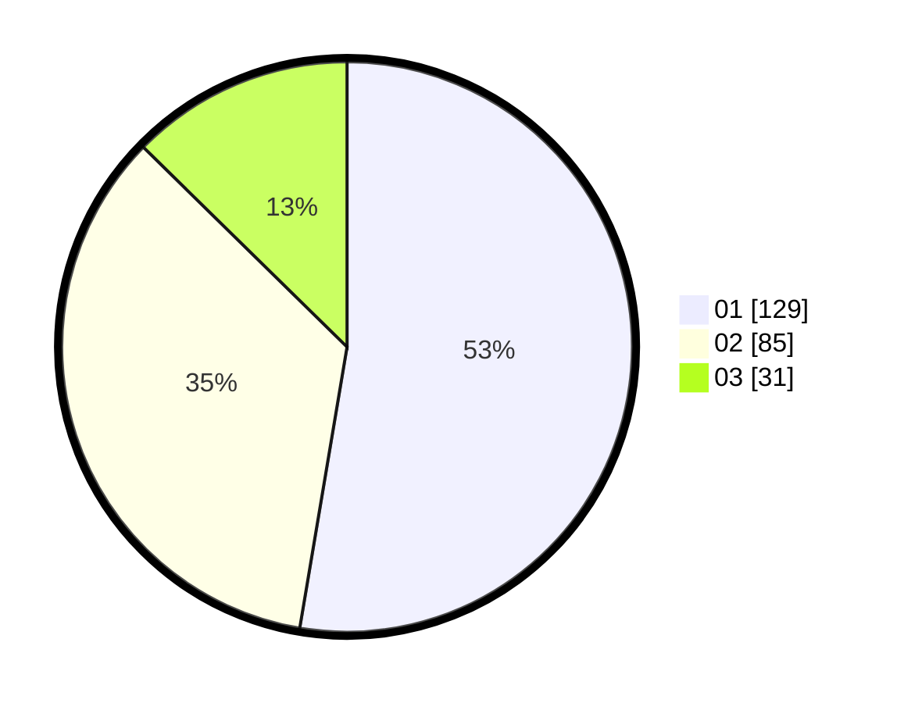

# Hasil

Hasil perolehan suara paslon dapat dilihat pada file paslon-01.txt, paslon-02.txt, dan paslon-03.txt.

Jika tidak ada, artinya data tersebut belum ada pada SIREKAP.

## Perolehan Suara

 * Paslon 01: **129**.
 * Paslon 02: **85**.
 * Paslon 03: **31**.

## Foto C Plano

https://sirekap-obj-formc.kpu.go.id/d6e8/pemilu/ppwp/31/75/03/10/01/3175031001051-20240216-112908--d1b52804-dd70-4403-9f83-24a44b3ae357.jpg

https://sirekap-obj-formc.kpu.go.id/d6e8/pemilu/ppwp/31/75/03/10/01/3175031001051-20240216-112910--375f98d8-cd6a-4865-8d0c-ea90ffc53042.jpg

https://sirekap-obj-formc.kpu.go.id/d6e8/pemilu/ppwp/31/75/03/10/01/3175031001051-20240216-112909--03cce7e9-36f7-478f-9c40-b3dbcea892c7.jpg

## DATA PEMILIH TETAP

Jumlah pemilih dalam DPT: **292**.
 * L: **146**.
 * P: **146**.

## DATA PENGGUNA HAK PILIH

Jumlah pengguna hak pilih dalam DPT: **241**.
 * L: **121**.
 * P: **120**.

Jumlah pengguna hak pilih dalam DPTb: **5**.
 * L: **2**.
 * P: **3**.

Jumlah pengguna hak pilih dalam DPK: **0**.
 * L: **0**.
 * P: **0**.

Jumlah pengguna hak pilih: **246**.
 * L: **123**.
 * P: **123**.

## JUMLAH SUARA SAH DAN TIDAK SAH

JUMLAH SELURUH SUARA SAH: **243**.

JUMLAH SUARA TIDAK SAH: **3**.

JUMLAH SELURUH SUARA SAH DAN SUARA TIDAK SAH: **246**.
