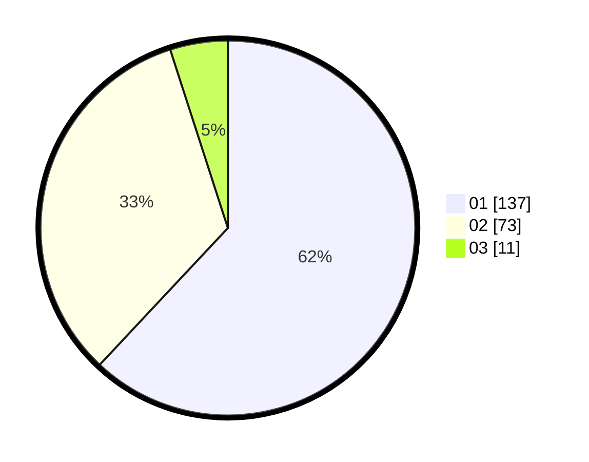

# Hasil

Hasil perolehan suara paslon dapat dilihat pada file paslon-01.txt, paslon-02.txt, dan paslon-03.txt.

Jika tidak ada, artinya data tersebut belum ada pada SIREKAP.

## Perolehan Suara

 * Paslon 01: **137**.
 * Paslon 02: **73**.
 * Paslon 03: **11**.

## Foto C Plano

https://sirekap-obj-formc.kpu.go.id/ae5a/pemilu/ppwp/31/75/03/10/01/3175031001057-20240214-195954--d2370ba9-36e3-4408-94a4-246f90f534b7.jpg

https://sirekap-obj-formc.kpu.go.id/ae5a/pemilu/ppwp/31/75/03/10/01/3175031001057-20240214-200111--4d6eb571-b65f-4098-bc76-cc0a35f880c8.jpg

https://sirekap-obj-formc.kpu.go.id/ae5a/pemilu/ppwp/31/75/03/10/01/3175031001057-20240214-213432--20ca59c2-8e74-4423-983f-8161482bcfe9.jpg
