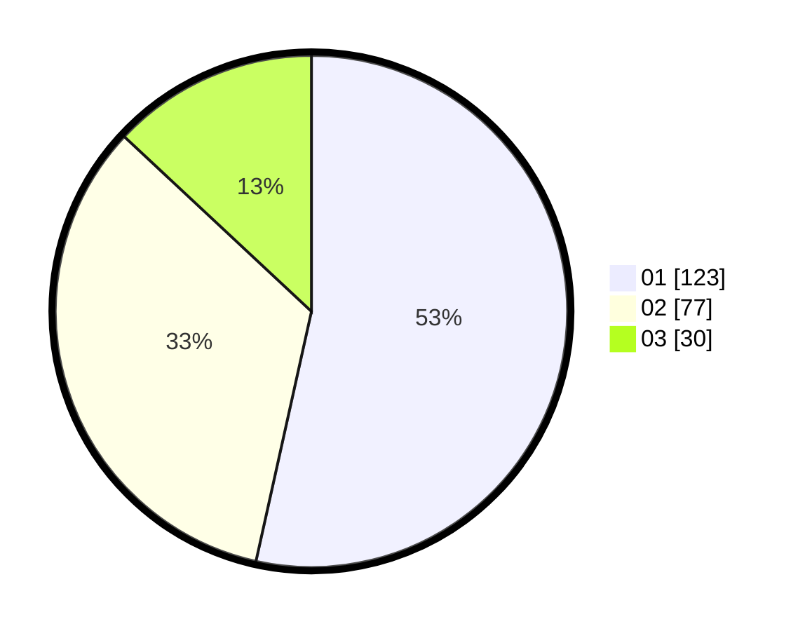

# Hasil

Hasil perolehan suara paslon dapat dilihat pada file paslon-01.txt, paslon-02.txt, dan paslon-03.txt.

Jika tidak ada, artinya data tersebut belum ada pada SIREKAP.

## Perolehan Suara

 * Paslon 01: **123**.
 * Paslon 02: **77**.
 * Paslon 03: **30**.

## Foto C Plano

https://sirekap-obj-formc.kpu.go.id/8f9d/pemilu/ppwp/31/75/03/10/01/3175031001059-20240217-200806--ac10599a-5d44-4a17-9082-81b72ec89016.jpg

https://sirekap-obj-formc.kpu.go.id/8f9d/pemilu/ppwp/31/75/03/10/01/3175031001059-20240217-201253--94aef966-c726-4d89-90d5-2e7ee9da00f5.jpg

https://sirekap-obj-formc.kpu.go.id/8f9d/pemilu/ppwp/31/75/03/10/01/3175031001059-20240217-201957--6327b777-e9b3-45d1-aa7f-89c1e42d1040.jpg

## DATA PEMILIH TETAP

Jumlah pemilih dalam DPT: **263**.
 * L: **142**.
 * P: **121**.

## DATA PENGGUNA HAK PILIH

Jumlah pengguna hak pilih dalam DPT: **231**.
 * L: **120**.
 * P: **111**.

Jumlah pengguna hak pilih dalam DPTb: **0**.
 * L: **0**.
 * P: **0**.

Jumlah pengguna hak pilih dalam DPK: **3**.
 * L: **2**.
 * P: **1**.

Jumlah pengguna hak pilih: **234**.
 * L: **122**.
 * P: **112**.

## JUMLAH SUARA SAH DAN TIDAK SAH

JUMLAH SELURUH SUARA SAH: **230**.

JUMLAH SUARA TIDAK SAH: **4**.

JUMLAH SELURUH SUARA SAH DAN SUARA TIDAK SAH: **234**.
