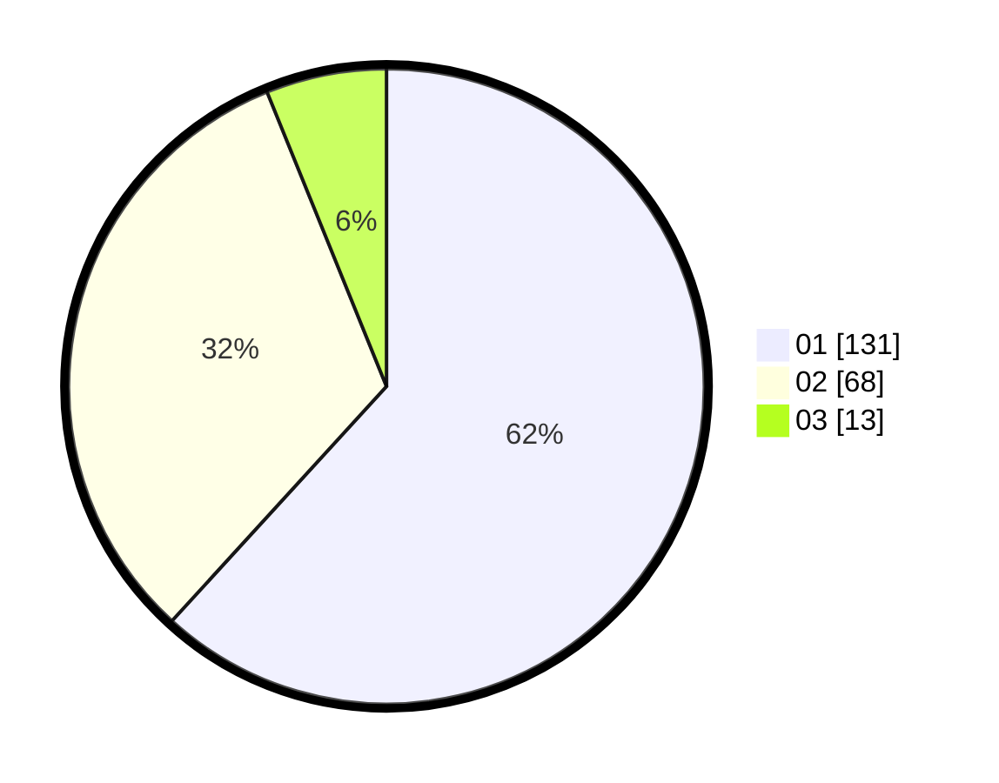

# Hasil

Hasil perolehan suara paslon dapat dilihat pada file paslon-01.txt, paslon-02.txt, dan paslon-03.txt.

Jika tidak ada, artinya data tersebut belum ada pada SIREKAP.

## Perolehan Suara

 * Paslon 01: **131**.
 * Paslon 02: **68**.
 * Paslon 03: **13**.

## Foto C Plano

https://sirekap-obj-formc.kpu.go.id/817f/pemilu/ppwp/31/75/03/10/01/3175031001060-20240215-232540--f032dd37-290f-4e59-9a8d-0949a8ffe926.jpg

https://sirekap-obj-formc.kpu.go.id/817f/pemilu/ppwp/31/75/03/10/01/3175031001060-20240215-232542--a62a19fd-f8ef-49dc-b4b5-1fae1577739b.jpg

https://sirekap-obj-formc.kpu.go.id/817f/pemilu/ppwp/31/75/03/10/01/3175031001060-20240215-232541--738cd750-f2e2-4383-9473-ae37f54de61f.jpg

## DATA PEMILIH TETAP

Jumlah pemilih dalam DPT: **266**.
 * L: **139**.
 * P: **127**.

## DATA PENGGUNA HAK PILIH

Jumlah pengguna hak pilih dalam DPT: **211**.
 * L: **107**.
 * P: **104**.

Jumlah pengguna hak pilih dalam DPTb: **1**.
 * L: **1**.
 * P: **0**.

Jumlah pengguna hak pilih dalam DPK: **0**.
 * L: **0**.
 * P: **0**.

Jumlah pengguna hak pilih: **212**.
 * L: **108**.
 * P: **104**.

## JUMLAH SUARA SAH DAN TIDAK SAH

JUMLAH SELURUH SUARA SAH: **212**.

JUMLAH SUARA TIDAK SAH: **0**.

JUMLAH SELURUH SUARA SAH DAN SUARA TIDAK SAH: **212**.
