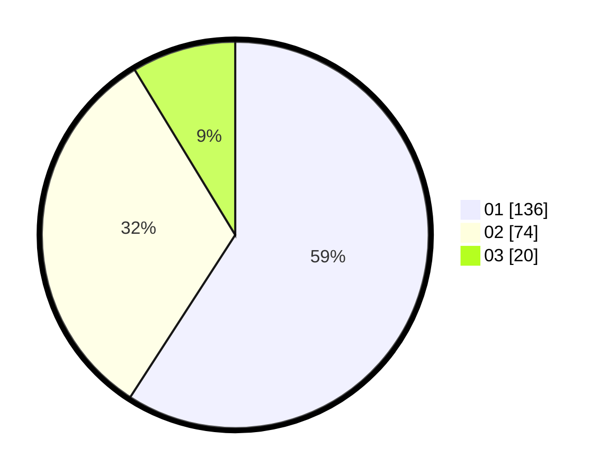

# Hasil

Hasil perolehan suara paslon dapat dilihat pada file paslon-01.txt, paslon-02.txt, dan paslon-03.txt.

Jika tidak ada, artinya data tersebut belum ada pada SIREKAP.

## Perolehan Suara

 * Paslon 01: **136**.
 * Paslon 02: **74**.
 * Paslon 03: **20**.

## Foto C Plano

https://sirekap-obj-formc.kpu.go.id/a04b/pemilu/ppwp/31/75/03/10/01/3175031001062-20240214-185856--766372e9-3f95-42f2-98d9-ddee81e35596.jpg

https://sirekap-obj-formc.kpu.go.id/a04b/pemilu/ppwp/31/75/03/10/01/3175031001062-20240214-185923--e5738070-99e2-4606-9a4c-f337f7d72640.jpg

https://sirekap-obj-formc.kpu.go.id/a04b/pemilu/ppwp/31/75/03/10/01/3175031001062-20240216-012605--c6254560-6a43-40c0-8015-592a512dc14b.jpg

## DATA PEMILIH TETAP

Jumlah pemilih dalam DPT: **283**.
 * L: **145**.
 * P: **138**.

## DATA PENGGUNA HAK PILIH

Jumlah pengguna hak pilih dalam DPT: **237**.
 * L: **120**.
 * P: **117**.

Jumlah pengguna hak pilih dalam DPTb: **0**.
 * L: **0**.
 * P: **0**.

Jumlah pengguna hak pilih dalam DPK: **1**.
 * L: **1**.
 * P: **0**.

Jumlah pengguna hak pilih: **238**.
 * L: **121**.
 * P: **117**.

## JUMLAH SUARA SAH DAN TIDAK SAH

JUMLAH SELURUH SUARA SAH: **230**.

JUMLAH SUARA TIDAK SAH: **8**.

JUMLAH SELURUH SUARA SAH DAN SUARA TIDAK SAH: **238**.
