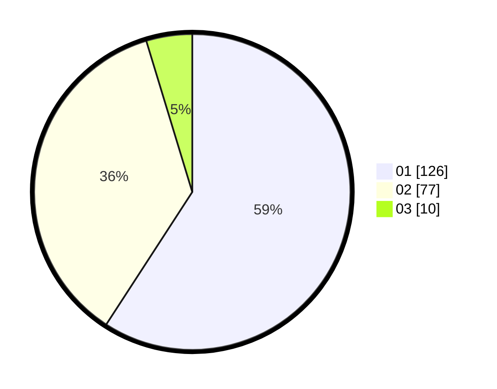

# Hasil

Hasil perolehan suara paslon dapat dilihat pada file paslon-01.txt, paslon-02.txt, dan paslon-03.txt.

Jika tidak ada, artinya data tersebut belum ada pada SIREKAP.

## Perolehan Suara

 * Paslon 01: **126**.
 * Paslon 02: **77**.
 * Paslon 03: **10**.

## Foto C Plano

https://sirekap-obj-formc.kpu.go.id/3f2a/pemilu/ppwp/31/75/03/10/01/3175031001066-20240215-003955--2a2ca22f-71d0-44dc-8c33-9e4c483c8c96.jpg

https://sirekap-obj-formc.kpu.go.id/3f2a/pemilu/ppwp/31/75/03/10/01/3175031001066-20240215-004017--1ed77790-b5e1-44aa-ae5f-20f49846c1b8.jpg

https://sirekap-obj-formc.kpu.go.id/3f2a/pemilu/ppwp/31/75/03/10/01/3175031001066-20240215-004006--25dde375-abea-4cb3-a12e-23e54c1d9516.jpg

## DATA PEMILIH TETAP

Jumlah pemilih dalam DPT: **258**.
 * L: **125**.
 * P: **133**.

## DATA PENGGUNA HAK PILIH

Jumlah pengguna hak pilih dalam DPT: **211**.
 * L: **94**.
 * P: **117**.

Jumlah pengguna hak pilih dalam DPTb: **2**.
 * L: **1**.
 * P: **1**.

Jumlah pengguna hak pilih dalam DPK: **1**.
 * L: **0**.
 * P: **1**.

Jumlah pengguna hak pilih: **214**.
 * L: **95**.
 * P: **119**.

## JUMLAH SUARA SAH DAN TIDAK SAH

JUMLAH SELURUH SUARA SAH: **213**.

JUMLAH SUARA TIDAK SAH: **1**.

JUMLAH SELURUH SUARA SAH DAN SUARA TIDAK SAH: **214**.
