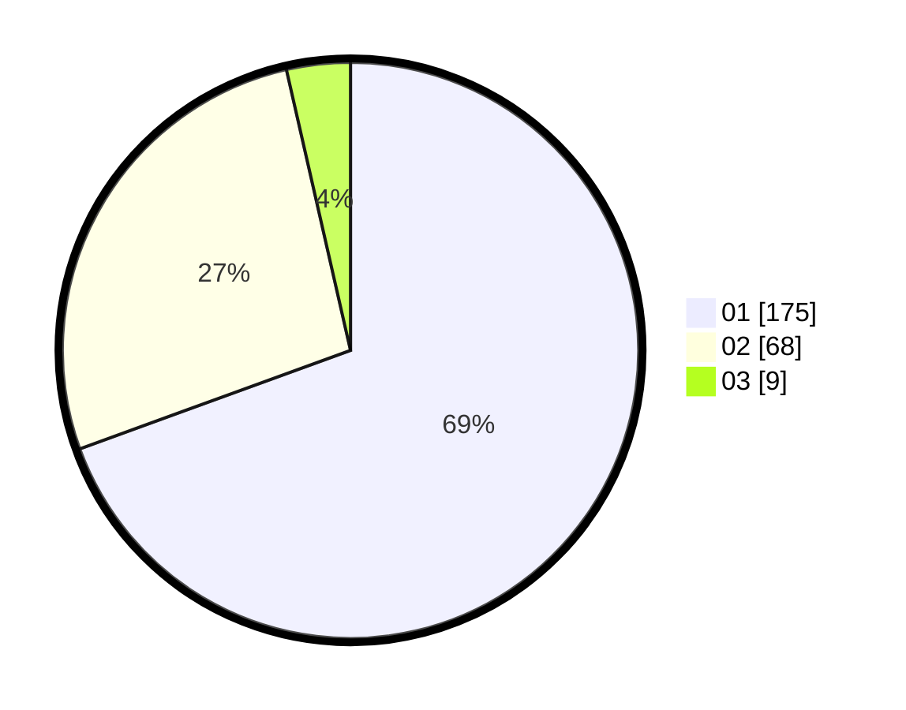

# Hasil

Hasil perolehan suara paslon dapat dilihat pada file paslon-01.txt, paslon-02.txt, dan paslon-03.txt.

Jika tidak ada, artinya data tersebut belum ada pada SIREKAP.

## Perolehan Suara

 * Paslon 01: **175**.
 * Paslon 02: **68**.
 * Paslon 03: **9**.

## Foto C Plano

https://sirekap-obj-formc.kpu.go.id/a306/pemilu/ppwp/31/75/03/10/01/3175031001077-20240214-162218--5c09485e-c457-49e6-852b-d0cef1836a59.jpg

https://sirekap-obj-formc.kpu.go.id/a306/pemilu/ppwp/31/75/03/10/01/3175031001077-20240214-162224--d0608ec3-5b79-4dd2-a043-467b0f79222a.jpg

https://sirekap-obj-formc.kpu.go.id/a306/pemilu/ppwp/31/75/03/10/01/3175031001077-20240214-162229--26be615c-76d3-463f-bbf7-b3b11697bc46.jpg
