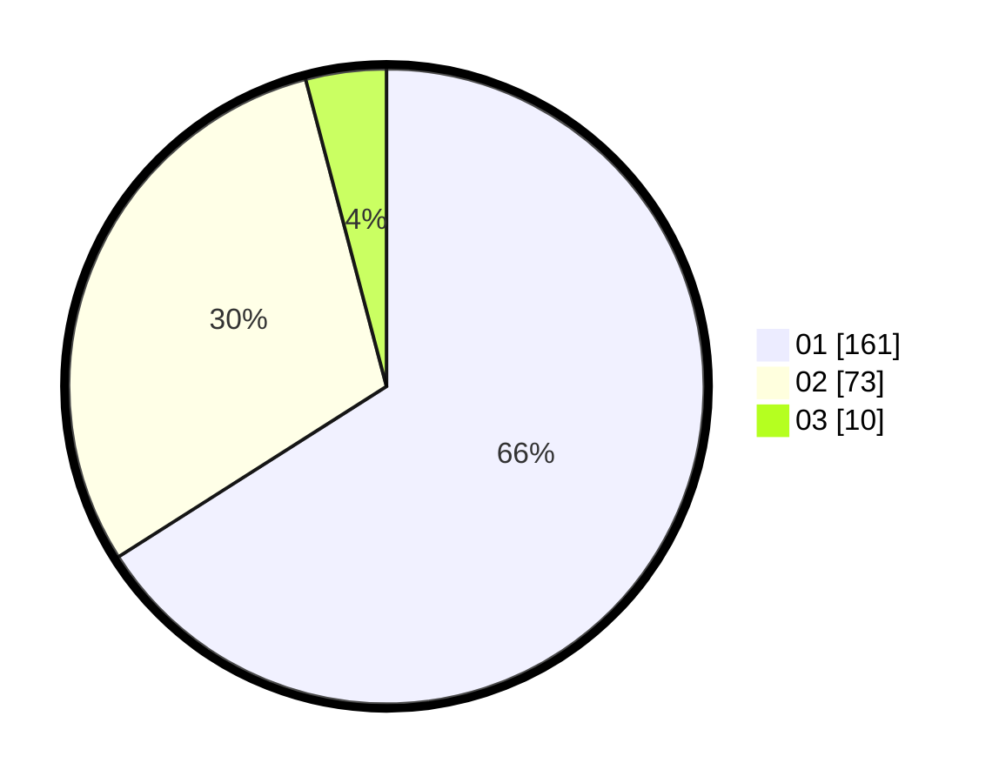

# Hasil

Hasil perolehan suara paslon dapat dilihat pada file paslon-01.txt, paslon-02.txt, dan paslon-03.txt.

Jika tidak ada, artinya data tersebut belum ada pada SIREKAP.

## Perolehan Suara

 * Paslon 01: **161**.
 * Paslon 02: **73**.
 * Paslon 03: **10**.

## Foto C Plano

https://sirekap-obj-formc.kpu.go.id/6dcd/pemilu/ppwp/31/75/03/10/01/3175031001078-20240216-135308--c4d09721-6cfa-4731-b6aa-5c0faa31f6ca.jpg

https://sirekap-obj-formc.kpu.go.id/6dcd/pemilu/ppwp/31/75/03/10/01/3175031001078-20240216-135310--0dc01561-a33b-4975-bbb9-6d5f134cebb1.jpg

https://sirekap-obj-formc.kpu.go.id/6dcd/pemilu/ppwp/31/75/03/10/01/3175031001078-20240216-135309--90432914-ab27-4c9b-8bb3-08e49074a4f5.jpg

## DATA PEMILIH TETAP

Jumlah pemilih dalam DPT: **286**.
 * L: **139**.
 * P: **147**.

## DATA PENGGUNA HAK PILIH

Jumlah pengguna hak pilih dalam DPT: **246**.
 * L: **124**.
 * P: **122**.

Jumlah pengguna hak pilih dalam DPTb: **1**.
 * L: **1**.
 * P: **0**.

Jumlah pengguna hak pilih dalam DPK: **1**.
 * L: **1**.
 * P: **0**.

Jumlah pengguna hak pilih: **248**.
 * L: **126**.
 * P: **122**.

## JUMLAH SUARA SAH DAN TIDAK SAH

JUMLAH SELURUH SUARA SAH: **244**.

JUMLAH SUARA TIDAK SAH: **4**.

JUMLAH SELURUH SUARA SAH DAN SUARA TIDAK SAH: **248**.
