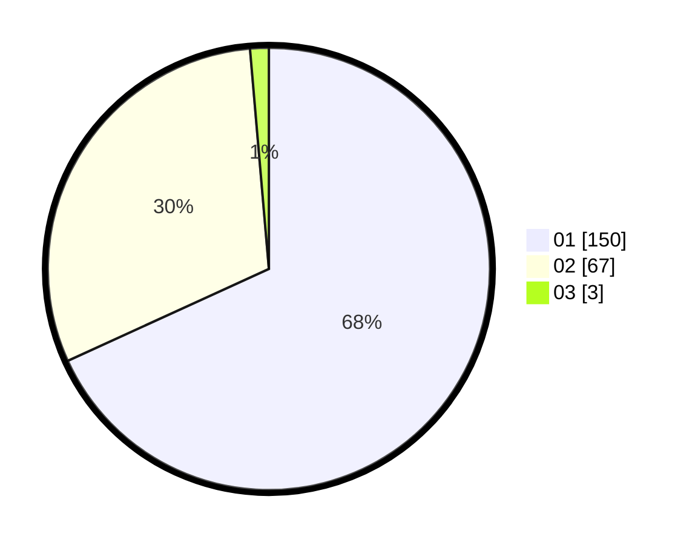

# Hasil

Hasil perolehan suara paslon dapat dilihat pada file paslon-01.txt, paslon-02.txt, dan paslon-03.txt.

Jika tidak ada, artinya data tersebut belum ada pada SIREKAP.

## Perolehan Suara

 * Paslon 01: **150**.
 * Paslon 02: **67**.
 * Paslon 03: **3**.

## Foto C Plano

https://sirekap-obj-formc.kpu.go.id/5708/pemilu/ppwp/31/75/03/10/01/3175031001079-20240215-033356--9faea762-6820-4168-9428-ab61523b434c.jpg

https://sirekap-obj-formc.kpu.go.id/5708/pemilu/ppwp/31/75/03/10/01/3175031001079-20240215-020732--8a2a526c-21d6-44fa-8da2-2df2f15adebe.jpg

https://sirekap-obj-formc.kpu.go.id/5708/pemilu/ppwp/31/75/03/10/01/3175031001079-20240215-020830--1ade2025-dff4-4797-9479-666534712784.jpg
