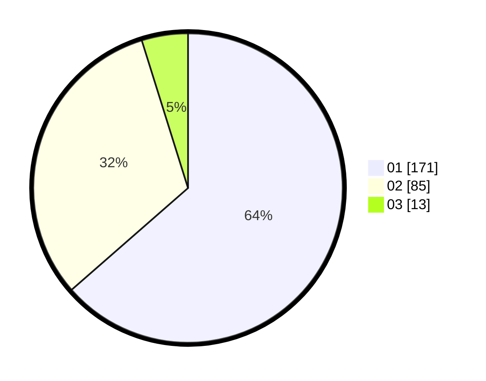

# Hasil

Hasil perolehan suara paslon dapat dilihat pada file paslon-01.txt, paslon-02.txt, dan paslon-03.txt.

Jika tidak ada, artinya data tersebut belum ada pada SIREKAP.

## Perolehan Suara

 * Paslon 01: **171**.
 * Paslon 02: **85**.
 * Paslon 03: **13**.

## Foto C Plano

https://sirekap-obj-formc.kpu.go.id/2e6c/pemilu/ppwp/31/75/03/10/01/3175031001083-20240214-205315--199f864f-fe6a-41e9-9efe-aef9f3d432a3.jpg

https://sirekap-obj-formc.kpu.go.id/2e6c/pemilu/ppwp/31/75/03/10/01/3175031001083-20240214-203017--195cf45e-6ced-4372-b187-81d95473ac12.jpg

https://sirekap-obj-formc.kpu.go.id/2e6c/pemilu/ppwp/31/75/03/10/01/3175031001083-20240214-205150--55bc2549-d0d8-4270-94d4-852feabe11ab.jpg
