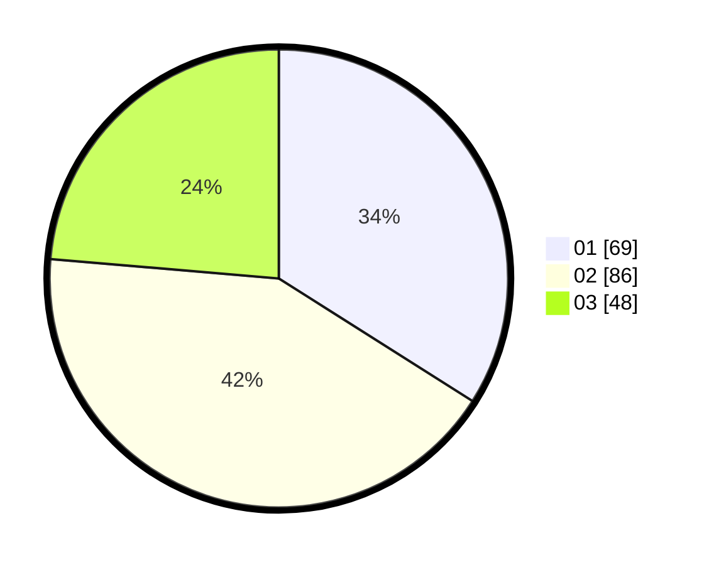

# Hasil

Hasil perolehan suara paslon dapat dilihat pada file paslon-01.txt, paslon-02.txt, dan paslon-03.txt.

Jika tidak ada, artinya data tersebut belum ada pada SIREKAP.

## Perolehan Suara

 * Paslon 01: **69**.
 * Paslon 02: **86**.
 * Paslon 03: **48**.

## Foto C Plano

https://sirekap-obj-formc.kpu.go.id/9790/pemilu/ppwp/31/75/03/10/02/3175031002001-20240214-220321--d9a10906-af8b-4c58-908f-681f7be2b8f7.jpg

https://sirekap-obj-formc.kpu.go.id/9790/pemilu/ppwp/31/75/03/10/02/3175031002001-20240214-220457--2e19bbc6-d610-4e56-8efd-09ce8f15aa65.jpg

https://sirekap-obj-formc.kpu.go.id/9790/pemilu/ppwp/31/75/03/10/02/3175031002001-20240214-221546--9081533f-e446-4377-8977-fcd79f03bb6c.jpg
