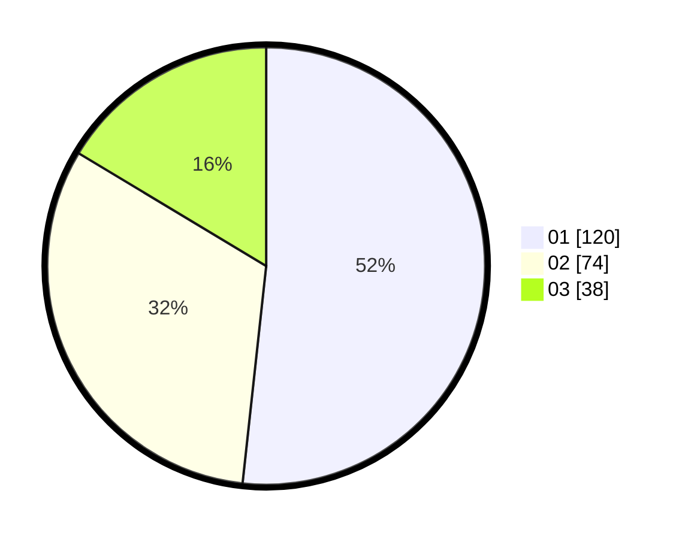

# Hasil

Hasil perolehan suara paslon dapat dilihat pada file paslon-01.txt, paslon-02.txt, dan paslon-03.txt.

Jika tidak ada, artinya data tersebut belum ada pada SIREKAP.

## Perolehan Suara

 * Paslon 01: **120**.
 * Paslon 02: **74**.
 * Paslon 03: **38**.

## Foto C Plano

https://sirekap-obj-formc.kpu.go.id/68c2/pemilu/ppwp/31/75/03/10/02/3175031002002-20240215-003916--b050bc3d-905b-49f8-bcc0-8707c03629e0.jpg

https://sirekap-obj-formc.kpu.go.id/68c2/pemilu/ppwp/31/75/03/10/02/3175031002002-20240217-155008--45184fad-a08e-44af-92e6-f8c43809f306.jpg

https://sirekap-obj-formc.kpu.go.id/68c2/pemilu/ppwp/31/75/03/10/02/3175031002002-20240217-154109--0512a192-d3b6-498d-afc3-f21eaf3fcb34.jpg
