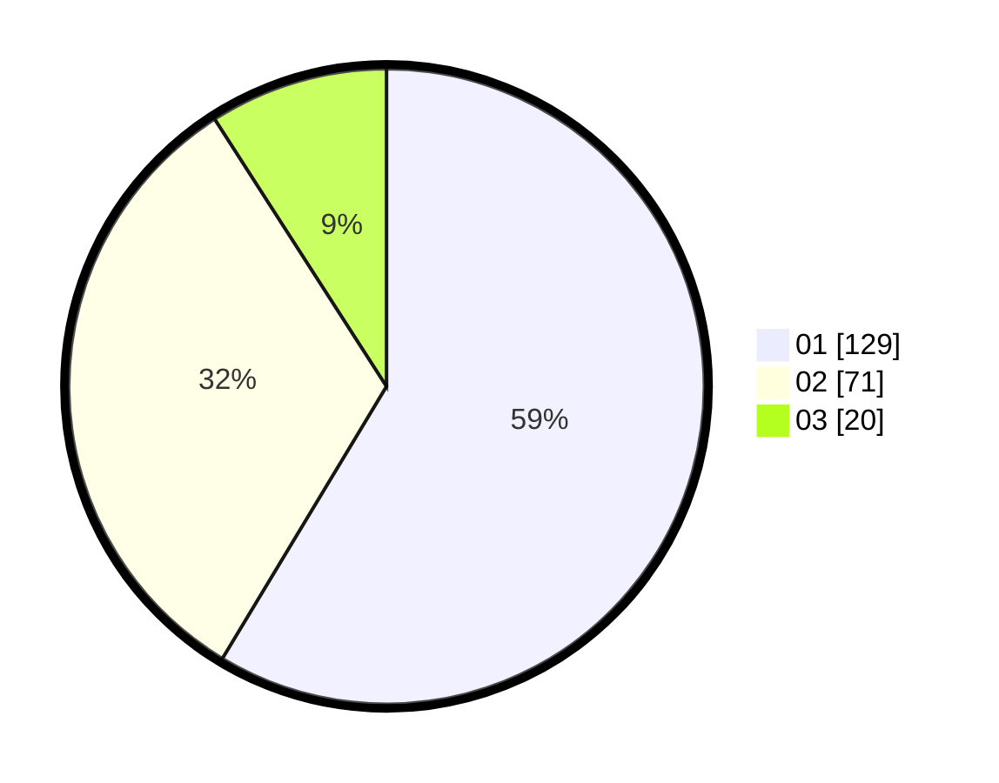

# Hasil

Hasil perolehan suara paslon dapat dilihat pada file paslon-01.txt, paslon-02.txt, dan paslon-03.txt.

Jika tidak ada, artinya data tersebut belum ada pada SIREKAP.

## Perolehan Suara

 * Paslon 01: **129**.
 * Paslon 02: **71**.
 * Paslon 03: **20**.

## Foto C Plano

https://sirekap-obj-formc.kpu.go.id/3cbb/pemilu/ppwp/31/75/03/10/02/3175031002009-20240214-195719--b58f1040-9a66-4391-b657-5d1febe9d3b4.jpg

https://sirekap-obj-formc.kpu.go.id/3cbb/pemilu/ppwp/31/75/03/10/02/3175031002009-20240214-195930--ff7474f0-8e5d-488a-a0d2-5b69a3f8ad21.jpg
