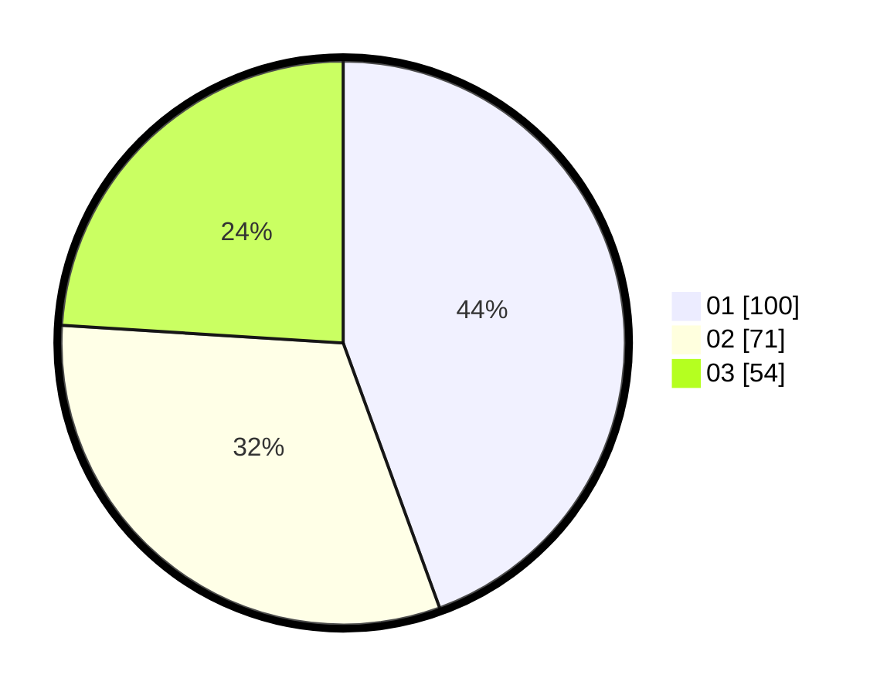

# Hasil

Hasil perolehan suara paslon dapat dilihat pada file paslon-01.txt, paslon-02.txt, dan paslon-03.txt.

Jika tidak ada, artinya data tersebut belum ada pada SIREKAP.

## Perolehan Suara

 * Paslon 01: **100**.
 * Paslon 02: **71**.
 * Paslon 03: **54**.

## Foto C Plano

https://sirekap-obj-formc.kpu.go.id/bbc9/pemilu/ppwp/31/75/03/10/02/3175031002010-20240214-234350--a886fa89-b9ec-45c6-b56b-e80394b58e54.jpg

https://sirekap-obj-formc.kpu.go.id/bbc9/pemilu/ppwp/31/75/03/10/02/3175031002010-20240214-234443--3e12e841-2440-483e-86c8-ceac89df4c00.jpg

https://sirekap-obj-formc.kpu.go.id/bbc9/pemilu/ppwp/31/75/03/10/02/3175031002010-20240214-234538--b4889dcb-73a5-4afd-8b31-a9752a5ce0aa.jpg
