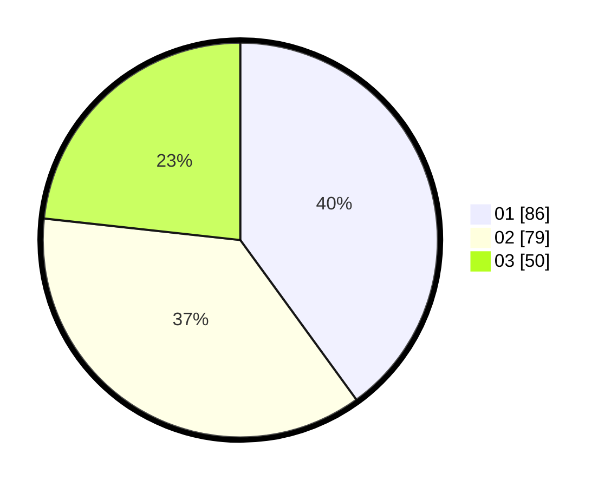

# Hasil

Hasil perolehan suara paslon dapat dilihat pada file paslon-01.txt, paslon-02.txt, dan paslon-03.txt.

Jika tidak ada, artinya data tersebut belum ada pada SIREKAP.

## Perolehan Suara

 * Paslon 01: **86**.
 * Paslon 02: **79**.
 * Paslon 03: **50**.

## Foto C Plano

https://sirekap-obj-formc.kpu.go.id/7e3e/pemilu/ppwp/31/75/03/10/02/3175031002014-20240214-231537--55e62676-4bbc-4d1c-b21b-3d4dc3c6a5e1.jpg

https://sirekap-obj-formc.kpu.go.id/7e3e/pemilu/ppwp/31/75/03/10/02/3175031002014-20240214-220040--a05b3ac1-3f3f-494f-9ae3-e38139cb4fb1.jpg

https://sirekap-obj-formc.kpu.go.id/7e3e/pemilu/ppwp/31/75/03/10/02/3175031002014-20240214-215813--c15a54fe-4eed-4011-b515-6692b3035c17.jpg
