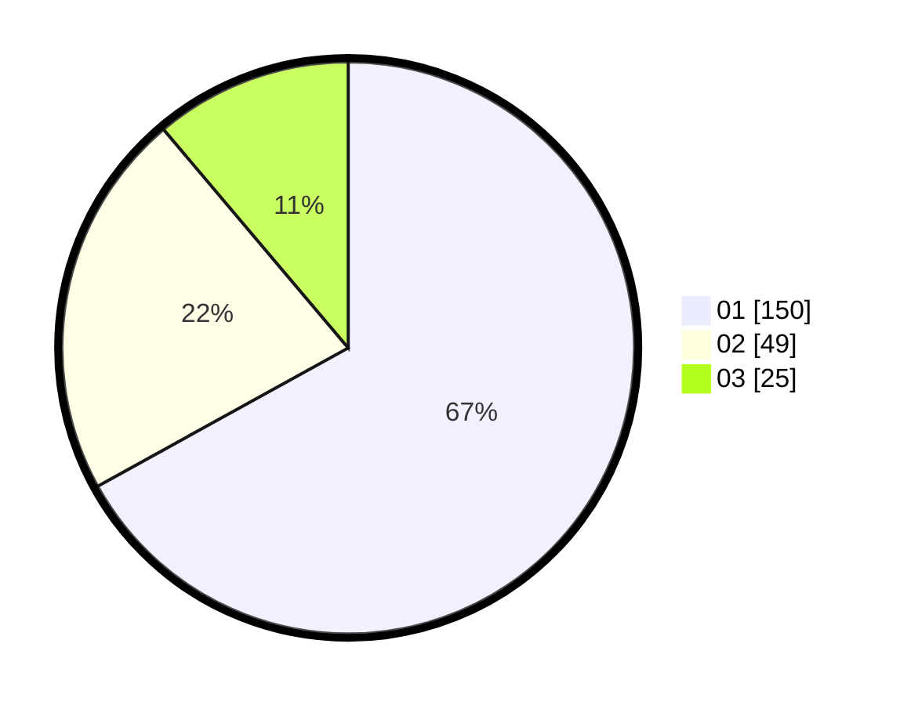

# Hasil

Hasil perolehan suara paslon dapat dilihat pada file paslon-01.txt, paslon-02.txt, dan paslon-03.txt.

Jika tidak ada, artinya data tersebut belum ada pada SIREKAP.

## Perolehan Suara

 * Paslon 01: **150**.
 * Paslon 02: **49**.
 * Paslon 03: **25**.

## Foto C Plano

https://sirekap-obj-formc.kpu.go.id/f3ad/pemilu/ppwp/31/75/03/10/02/3175031002017-20240214-211206--1a796e81-864b-4ccb-8f28-8a5ad651541a.jpg

https://sirekap-obj-formc.kpu.go.id/f3ad/pemilu/ppwp/31/75/03/10/02/3175031002017-20240214-211025--de0532a2-be65-4510-94f7-fdd49fc36f5c.jpg

https://sirekap-obj-formc.kpu.go.id/f3ad/pemilu/ppwp/31/75/03/10/02/3175031002017-20240214-211330--01e6c49a-b906-4ae0-9e31-d2c3997d4a86.jpg

## DATA PEMILIH TETAP

Jumlah pemilih dalam DPT: **262**.
 * L: **125**.
 * P: **137**.

## DATA PENGGUNA HAK PILIH

Jumlah pengguna hak pilih dalam DPT: **198**.
 * L: **96**.
 * P: **102**.

Jumlah pengguna hak pilih dalam DPTb: **28**.
 * L: **5**.
 * P: **23**.

Jumlah pengguna hak pilih dalam DPK: **0**.
 * L: **0**.
 * P: **0**.

Jumlah pengguna hak pilih: **226**.
 * L: **101**.
 * P: **125**.

## JUMLAH SUARA SAH DAN TIDAK SAH

JUMLAH SELURUH SUARA SAH: **224**.

JUMLAH SUARA TIDAK SAH: **2**.

JUMLAH SELURUH SUARA SAH DAN SUARA TIDAK SAH: **226**.
