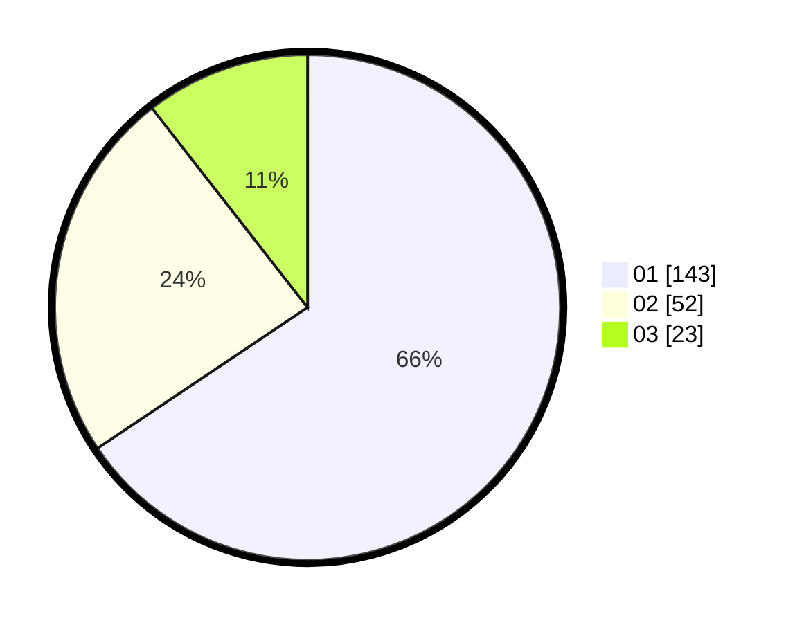

# Hasil

Hasil perolehan suara paslon dapat dilihat pada file paslon-01.txt, paslon-02.txt, dan paslon-03.txt.

Jika tidak ada, artinya data tersebut belum ada pada SIREKAP.

## Perolehan Suara

 * Paslon 01: **143**.
 * Paslon 02: **52**.
 * Paslon 03: **23**.

## Foto C Plano

https://sirekap-obj-formc.kpu.go.id/314c/pemilu/ppwp/31/75/03/10/02/3175031002020-20240214-230545--5a5cb2ae-9f3b-44bb-aca6-703bd1d679c4.jpg

https://sirekap-obj-formc.kpu.go.id/314c/pemilu/ppwp/31/75/03/10/02/3175031002020-20240214-230810--ae7f6f7c-2f30-4b30-94c3-cea2af651b50.jpg

https://sirekap-obj-formc.kpu.go.id/314c/pemilu/ppwp/31/75/03/10/02/3175031002020-20240214-230955--07262c02-cfbb-4f6d-91e7-2a5f6ddd9681.jpg
