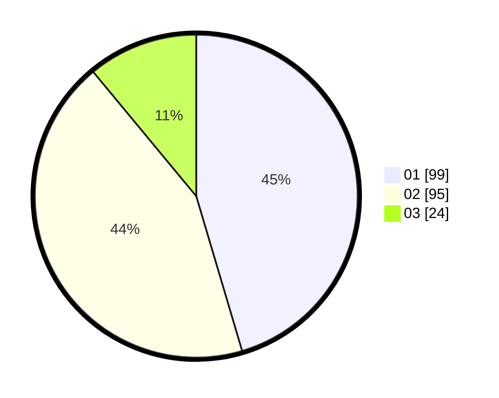

# Hasil

Hasil perolehan suara paslon dapat dilihat pada file paslon-01.txt, paslon-02.txt, dan paslon-03.txt.

Jika tidak ada, artinya data tersebut belum ada pada SIREKAP.

## Perolehan Suara

 * Paslon 01: **99**.
 * Paslon 02: **95**.
 * Paslon 03: **24**.

## Foto C Plano

https://sirekap-obj-formc.kpu.go.id/b047/pemilu/ppwp/31/75/03/10/02/3175031002022-20240214-191019--194395d5-736f-46c4-9172-c9d799fe8944.jpg

https://sirekap-obj-formc.kpu.go.id/b047/pemilu/ppwp/31/75/03/10/02/3175031002022-20240214-193824--0d59b845-dd99-4fd1-993f-7a682f5c4dbb.jpg

https://sirekap-obj-formc.kpu.go.id/b047/pemilu/ppwp/31/75/03/10/02/3175031002022-20240214-191057--1c0bb8d9-7ea9-49a4-8530-bb85aeeecb11.jpg

## DATA PEMILIH TETAP

Jumlah pemilih dalam DPT: **262**.
 * L: **127**.
 * P: **135**.

## DATA PENGGUNA HAK PILIH

Jumlah pengguna hak pilih dalam DPT: **203**.
 * L: **94**.
 * P: **109**.

Jumlah pengguna hak pilih dalam DPTb: **15**.
 * L: **5**.
 * P: **10**.

Jumlah pengguna hak pilih dalam DPK: **2**.
 * L: **1**.
 * P: **1**.

Jumlah pengguna hak pilih: **220**.
 * L: **100**.
 * P: **120**.

## JUMLAH SUARA SAH DAN TIDAK SAH

JUMLAH SELURUH SUARA SAH: **218**.

JUMLAH SUARA TIDAK SAH: **2**.

JUMLAH SELURUH SUARA SAH DAN SUARA TIDAK SAH: **220**.
